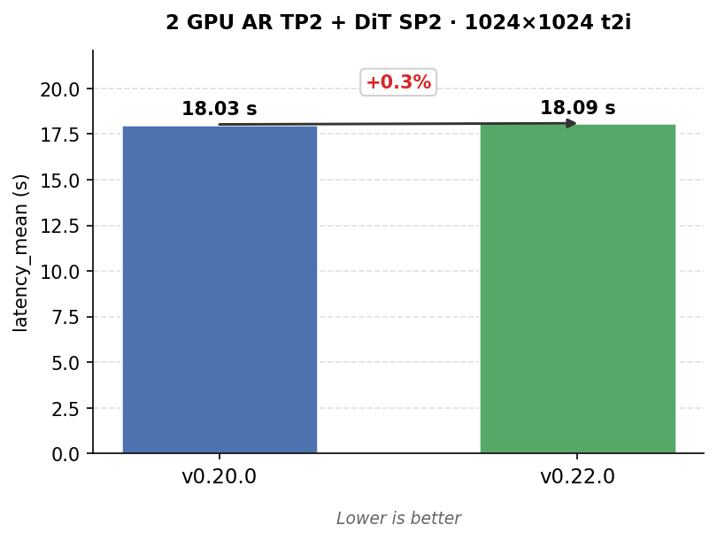
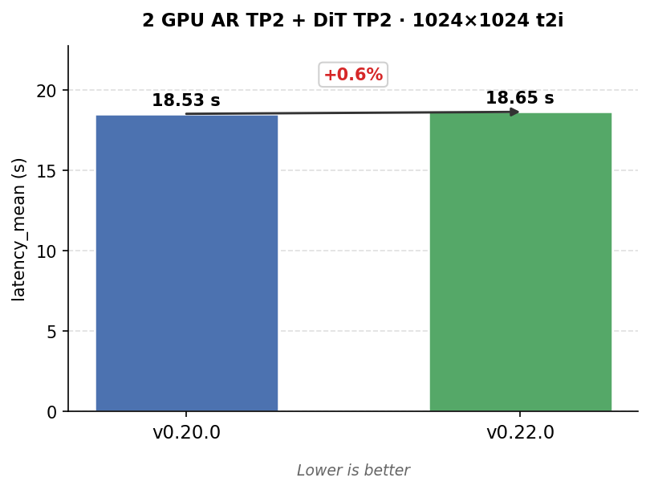
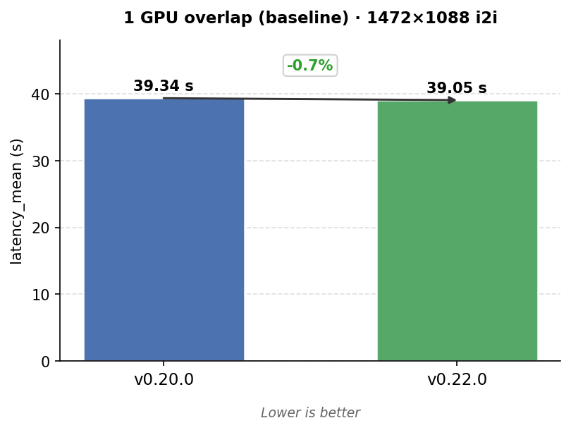
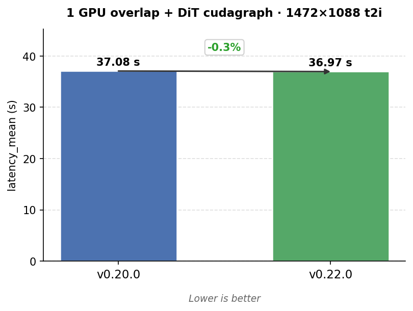
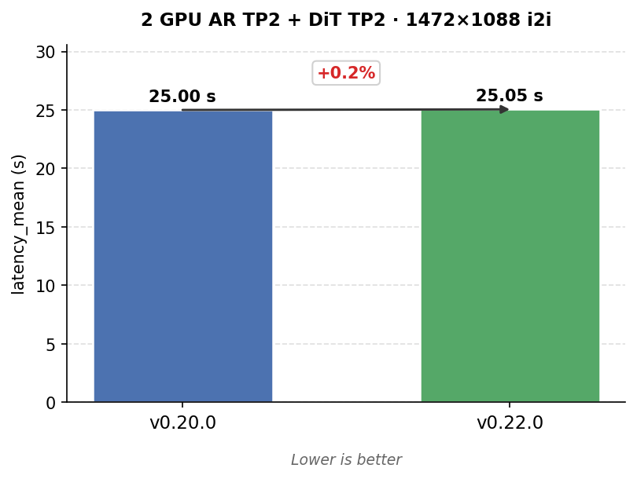
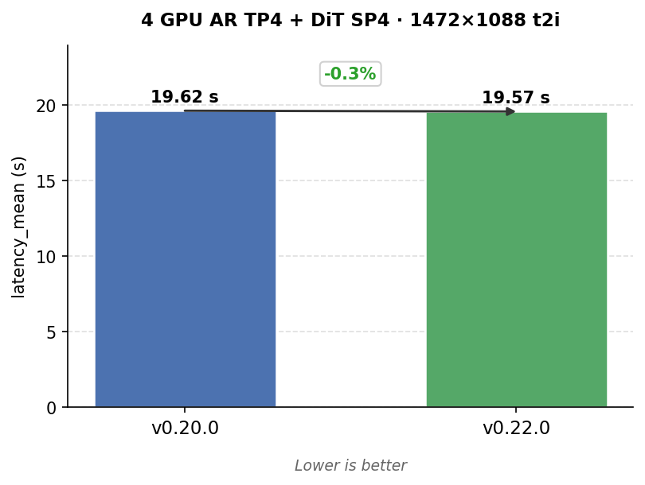
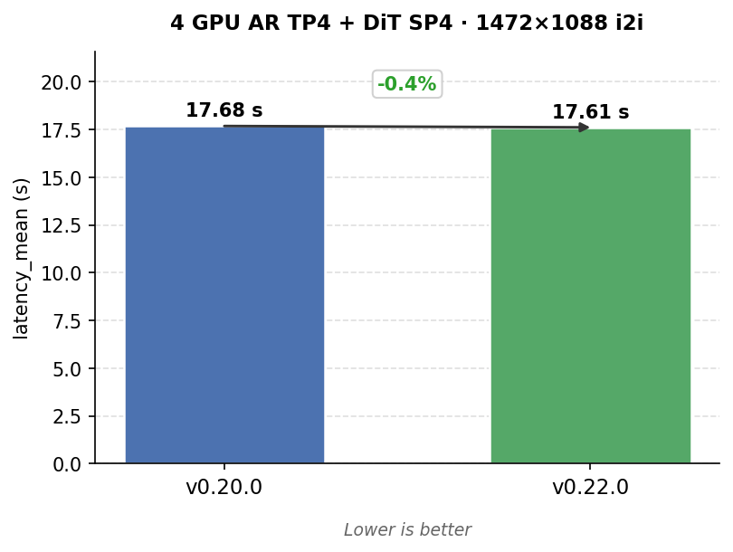

# GLM-Image

**Category:** Diffusion (text-to-image and image-to-image editing)  
**Model:** `zai-org/GLM-Image` / local checkpoint `GLM-Image`  
**Recipe:** [GLM-Image Usage Guide](https://github.com/vllm-project/recipes/blob/main/GLM/GLM-Image.md) (**TODO:** update; the current recipe predates the v0.22 cookbook measurements).  
**Primary metric:** end-to-end `latency_mean` in seconds, lower is better.  
**Pipeline:** GLM-Image is served as a two-stage multi-stage pipeline: **stage 0 AR** produces image prior tokens, then **stage 1 DiT/VAE** generates the image.

This page tracks the focused GLM-Image cookbook benchmark across vLLM-Omni **v0.20.0** and **v0.22.0**. The benchmark intentionally keeps both **t2i** and **i2i** workloads because the order is the same for both tasks; t2i remains the primary headline metric, and i2i is shown side by side.

---

## Performance tracks

| Track | Hardware | Source |
|-------|----------|--------|
| **Focused GLM matrix** | 4x NVIDIA H800 (measured) | [v0.20](v0.20/) · [v0.22](v0.22/) |
| **Runner** | pytest + OpenAI `/v1/chat/completions` | `vllm-omni/tests/dfx/perf/scripts/run_diffusion_benchmark.py` |
| **Nightly CI candidate** | 4x GPU focused matrix | `vllm-omni/tests/dfx/perf/tests/test_glm_image_vllm_omni_focused_inline.json` (TODO: push upstream and raise PR) |

## Evidence

| Field | v0.20 | v0.22 |
|-------|-------|-------|
| Release tag | `v0.20.0` | `v0.22.0` |
| Checkout SHA | `4a24a517` | `963ba1ab` |
| Cookbook config links | [`v0.20/test_glm_image_vllm_omni_focused_inline.json`](v0.20/test_glm_image_vllm_omni_focused_inline.json) | [`v0.22/test_glm_image_vllm_omni_focused_inline.json`](v0.22/test_glm_image_vllm_omni_focused_inline.json) |

---

## v0.22.0

The v0.22 focused run is at parity with v0.20 on this H800 matrix: every measured t2i/i2i delta is within about 1%, and the ranking is unchanged across 1, 2, and 4 GPU groups.

| GPU group | Best config at v0.22 | 1024x1024 t2i | 1472x1088 t2i |
|-----------|----------------------|--------------:|---------------:|
| 1 GPU | `1gpu_overlap_dit_cudagraph` | **24.87 s** | **36.97 s** |
| 2 GPU | `2gpu_artp2_sp2_dit_cudagraph` | **18.09 s** | **26.25 s** |
| 4 GPU | `4gpu_tp4_sp4_overlap_dit_cudagraph` | **13.89 s** | **19.57 s** |

Relevant v0.22-cycle GLM-Image work includes the GLM-Image recipe ([#2950](https://github.com/vllm-project/vllm-omni/pull/2950)), W4A16 AutoRound coverage ([#3059](https://github.com/vllm-project/vllm-omni/pull/3059)), NPU stage env/config plumbing ([#3235](https://github.com/vllm-project/vllm-omni/pull/3235)), and the L4 feature e2e test ([#3451](https://github.com/vllm-project/vllm-omni/pull/3451)).

**Notes**

1. **Default 2-GPU split (not in matrix).** Putting stage 0 AR (~18.88 GiB model weights) on GPU 0 and stage 1 DiT (~14.07 GiB) on GPU 1 — the stock `glm_image.yaml` topology — yields E2E latency very close to, or slightly worse than, colocating both stages on one H800. (`1gpu_overlap_dit_cudagraph`: ~24.87 s vs default 2-GPU with cudagraph ~25.96 s for 1024×1024 t2i). This layout is therefore **not included in the focused test matrix** and is **not a recommended set-up on H800-class hardware** where a single GPU already fits the workload.

2. **24 GB GPUs.** 2-GPU should be enough. For 1024×1024 workloads in the H800 matrix next section, reported peak memory stays below ~23 GiB per GPU in all 2-GPU cases; peak grows with output resolution (e.g. 1472×1088 often reached ~20–29 GiB peak per GPU in our `test_glm_image_vllm_omni_focused_inline.json` setting). If a card is tight on memory: lower stage 0 `gpu_memory_utilization` to shrink the AR KV pool, cap output resolution, or prefer **TP2 on both stages** over **SP** where per-GPU footprint matters more than raw latency (e.g. `2gpu_tp2_overlap_dit_cudagraph` reports ~17 GiB peak on 1024 t2i vs ~23 GiB for SP-based configs).

---

## H800 Retro Comparison

Measured **2026-06-08** on **4x NVIDIA H800**. Δ format: approximate percent first , then `(v0.20 -> v0.22)`.

Config naming note: `*_dit_cudagraph` means the DiT/diffusion stage uses `enforce_eager: false`; the paired baseline keeps stage 1 eager. In all focused/retro configs here, stage 0 AR already uses `enforce_eager: false`, so the `_dit_cudagraph` suffix only marks the stage 1 difference.

### 1024x1024

| Config | t2i v0.20 | t2i v0.22 | Δ t2i | i2i v0.20 | i2i v0.22 | Δ i2i |
|---|---:|---:|---:|---:|---:|---:|
| `1 GPU overlap (baseline)` | 28.30 | 28.11 | ~−0.7%<br>(28.30 -> 28.11) | 25.29 | 25.15 | ~−0.6%<br>(25.29 -> 25.15) |
| `1 GPU overlap + DiT cudagraph` | 24.99 | 24.87 | ~−0.5%<br>(24.99 -> 24.87) | 21.94 | 21.85 | ~−0.4%<br>(21.94 -> 21.85) |
| `2 GPU AR TP2 + DiT SP2` | 18.03 | 18.09 | ~+0.3%<br>(18.03 -> 18.09) | 15.71 | 15.74 | ~+0.1%<br>(15.71 -> 15.74) |
| `2 GPU AR TP2 + DiT TP2` | 18.53 | 18.65 | ~+0.7%<br>(18.53 -> 18.65) | 16.23 | 16.32 | ~+0.6%<br>(16.23 -> 16.32) |
| `4 GPU AR TP4 + DiT SP4` | 13.82 | 13.89 | ~+0.5%<br>(13.82 -> 13.89) | 11.85 | 11.86 | ~+0.1%<br>(11.85 -> 11.86) |
| `4 GPU AR TP4 + DiT TP4` | 15.11 | 15.12 | ~+0.1%<br>(15.11 -> 15.12) | 13.13 | 13.09 | ~−0.4%<br>(13.13 -> 13.09) |

<details>
<summary><strong>1024×1024 charts (12)</strong> — v0.20.0 vs v0.22.0 bar charts; lower is better</summary>

<table>
<tr>
<td></td>
<td></td>
</tr>
<tr>
<td></td>
<td></td>
</tr>
<tr>
<td></td>
<td></td>
</tr>
<tr>
<td></td>
<td></td>
</tr>
<tr>
<td></td>
<td></td>
</tr>
<tr>
<td></td>
<td></td>
</tr>
</table>

</details>

### 1472x1088

| Config | t2i v0.20 | t2i v0.22 | Δ t2i | i2i v0.20 | i2i v0.22 | Δ i2i |
|---|---:|---:|---:|---:|---:|---:|
| `1 GPU overlap (baseline)` | 41.96 | 41.80 | ~−0.4%<br>(41.96 -> 41.80) | 39.34 | 39.05 | ~−0.7%<br>(39.34 -> 39.05) |
| `1 GPU overlap + DiT cudagraph` | 37.08 | 36.97 | ~−0.3%<br>(37.08 -> 36.97) | 34.27 | 34.22 | ~−0.1%<br>(34.27 -> 34.22) |
| `2 GPU AR TP2 + DiT SP2` | 26.15 | 26.25 | ~+0.4%<br>(26.15 -> 26.25) | 24.10 | 24.14 | ~+0.1%<br>(24.10 -> 24.14) |
| `2 GPU AR TP2 + DiT TP2` | 27.02 | 27.16 | ~+0.5%<br>(27.02 -> 27.16) | 25.00 | 25.05 | ~+0.2%<br>(25.00 -> 25.05) |
| `4 GPU AR TP4 + DiT SP4` | 19.62 | 19.57 | ~−0.3%<br>(19.62 -> 19.57) | 17.68 | 17.61 | ~−0.4%<br>(17.68 -> 17.61) |
| `4 GPU AR TP4 + DiT TP4` | 21.73 | 21.70 | ~−0.2%<br>(21.73 -> 21.70) | 19.83 | 19.77 | ~−0.3%<br>(19.83 -> 19.77) |

<details>
<summary><strong>1472×1088 charts (12)</strong> — v0.20.0 vs v0.22.0 bar charts; lower is better</summary>

<table>
<tr>
<td></td>
<td></td>
</tr>
<tr>
<td></td>
<td></td>
</tr>
<tr>
<td></td>
<td></td>
</tr>
<tr>
<td></td>
<td></td>
</tr>
<tr>
<td></td>
<td></td>
</tr>
<tr>
<td></td>
<td></td>
</tr>
</table>

</details>

Ranking by GPU group:

- 1 GPU: `1gpu_overlap_dit_cudagraph` beats `1gpu_overlap`.
- 2 GPU: `2gpu_artp2_sp2_dit_cudagraph` beats `2gpu_tp2_overlap_dit_cudagraph`.
- 4 GPU: `4gpu_tp4_sp4_overlap_dit_cudagraph` beats `4gpu_tp4_tp4_overlap_dit_cudagraph`.

The ranking is exactly the same for both t2i and i2i between v0.20.0 and v0.22.0.

### Remark

No GLM-Image-specific optimization work done in the v0.20.0 → v0.22.0 upgrade.

---

## Stage timing snapshot (v0.22 t2i)

These numbers are useful for understanding where the time goes, but they should not replace the E2E latency table above. `stage_0_gen` is the AR stage; `stage_1_gen` is the DiT denoise window on stage 1; `vae_decode` is measured separately by the diffusion pipeline profiler. **E2E ≈ Stage 0 + Stage 1 + VAE decode** (within ~0.1 s). DiT diffuse is the bulk of Stage 1. Units are seconds.

| Config | Workload | E2E | Stage 0 gen | Stage 1 gen | DiT diffuse | VAE decode |
|---|---|---:|---:|---:|---:|---:|
| `1gpu_overlap` | 1024x1024 t2i | 28.11 | 14.02 | 13.90 | 13.64 | 0.19 |
| `1gpu_overlap_dit_cudagraph` | 1024x1024 t2i | 24.87 | 14.03 | 10.65 | 10.39 | 0.19 |
| `2gpu_artp2_sp2_dit_cudagraph` | 1024x1024 t2i | 18.09 | 11.38 | 6.52 | 6.26 | 0.19 |
| `2gpu_tp2_overlap_dit_cudagraph` | 1024x1024 t2i | 18.65 | 11.33 | 7.13 | 6.87 | 0.19 |
| `4gpu_tp4_sp4_overlap_dit_cudagraph` | 1024x1024 t2i | 13.89 | 9.53 | 4.17 | 3.89 | 0.19 |
| `4gpu_tp4_tp4_overlap_dit_cudagraph` | 1024x1024 t2i | 15.12 | 9.48 | 5.44 | 5.18 | 0.19 |
| `1gpu_overlap` | 1472x1088 t2i | 41.80 | 19.68 | 21.84 | 21.46 | 0.29 |
| `1gpu_overlap_dit_cudagraph` | 1472x1088 t2i | 36.97 | 19.71 | 16.99 | 16.61 | 0.29 |
| `2gpu_artp2_sp2_dit_cudagraph` | 1472x1088 t2i | 26.25 | 15.96 | 10.08 | 9.70 | 0.29 |
| `2gpu_tp2_overlap_dit_cudagraph` | 1472x1088 t2i | 27.16 | 15.89 | 11.06 | 10.68 | 0.29 |
| `4gpu_tp4_sp4_overlap_dit_cudagraph` | 1472x1088 t2i | 19.57 | 13.37 | 5.90 | 5.51 | 0.29 |
| `4gpu_tp4_tp4_overlap_dit_cudagraph` | 1472x1088 t2i | 21.70 | 13.29 | 8.08 | 7.71 | 0.29 |

**Interpretation:** CUDA graph mainly reduces stage 1 / DiT time. SP is consistently better than TP for the DiT stage in this GLM matrix, especially at 4 GPUs.

---

## 1-GPU Retro Comparison

This retro slice tracks the oldest comparable 1-GPU GLM-Image path across v0.16, v0.18, v0.20, and v0.22: 1024x1024, 50 inference steps, max-concurrency 1, and `latency_mean` in seconds.

| Config | Task | v0.16 | v0.18 | v0.20 | v0.22 |
|---|---|---:|---:|---:|---:|
| `1gpu_overlap` | t2i | 39.83 | 33.63 | 28.30 | 28.11 |
| `1gpu_overlap` | i2i | 39.57 | not runnable | 25.29 | 25.15 |
| `1gpu_overlap_dit_cudagraph` | t2i | 39.55 | 29.95 | 24.99 | 24.87 |
| `1gpu_overlap_dit_cudagraph` | i2i | 39.40 | not runnable | 21.94 | 21.85 |

v0.18 i2i starts the server but fails before generation in the stock `/v1/chat/completions` multimodal preprocessing path. Keep it as `not runnable` for an unpatched retro run; the relevant v0.20-line fixes include [#2320](https://github.com/vllm-project/vllm-omni/pull/2320), [#3024](https://github.com/vllm-project/vllm-omni/pull/3024), and [#3189](https://github.com/vllm-project/vllm-omni/pull/3189).

---

## Release index

| Release | GLM-Image highlight | Relevant PRs |
|---------|---------------------|--------------|
| [v0.22.0](https://github.com/vllm-project/vllm-omni/releases/tag/v0.22.0) | Covers GLM-Image work after v0.20 and before/at v0.22. Fresh H800 focused run stays within ~1% of v0.20; recipe added but still needs cookbook refresh; W4A16 AutoRound and L4 feature coverage land. | recipe [#2950](https://github.com/vllm-project/vllm-omni/pull/2950), AutoRound W4A16 [#3059](https://github.com/vllm-project/vllm-omni/pull/3059), NPU stage env/config [#3235](https://github.com/vllm-project/vllm-omni/pull/3235), L4 feature e2e [#3451](https://github.com/vllm-project/vllm-omni/pull/3451) |
| [v0.20.0](https://github.com/vllm-project/vllm-omni/releases/tag/v0.20.0) | Covers GLM-Image work after v0.18 and before/at v0.20. Main GLM-Image serving/perf stack matures: SP, HSDP, Cache-DiT, quantization, image-edit fixes, config refactor, benchmark/bugfix work, t2i routing, and processor-cache latency reduction. | Cache-DiT [#1399](https://github.com/vllm-project/vllm-omni/pull/1399), SP [#1983](https://github.com/vllm-project/vllm-omni/pull/1983), HSDP [#2029](https://github.com/vllm-project/vllm-omni/pull/2029), quantization [#2292](https://github.com/vllm-project/vllm-omni/pull/2292), output dims / image edit [#2320](https://github.com/vllm-project/vllm-omni/pull/2320), config refactor [#2977](https://github.com/vllm-project/vllm-omni/pull/2977), benchmark + bugfix [#3024](https://github.com/vllm-project/vllm-omni/pull/3024), online generation fix [#3084](https://github.com/vllm-project/vllm-omni/pull/3084), t2i multimodal routing [#3189](https://github.com/vllm-project/vllm-omni/pull/3189), processor cache [#3245](https://github.com/vllm-project/vllm-omni/pull/3245) |
| [v0.18.0](https://github.com/vllm-project/vllm-omni/releases/tag/v0.18.0) | Covers GLM-Image work after v0.16 and before/at v0.18. GLM-Image stage config and TP support become available in an even stable release. | diffusers-format stage config [#1894](https://github.com/vllm-project/vllm-omni/pull/1894), TP [#1918](https://github.com/vllm-project/vllm-omni/pull/1918) |
| [v0.16.0](https://github.com/vllm-project/vllm-omni/releases/tag/v0.16.0) | Initial tracked stable GLM-Image release-line baseline. | GLM Image perf/model support [#920](https://github.com/vllm-project/vllm-omni/pull/920) |

Notes:

- Non-TP diffusion CLI flags for multi-stage GLM-Image are still tracked in [issue #4040](https://github.com/vllm-project/vllm-omni/issues/4040); prefer deploy YAML for multi-stage parallel configs in v0.22.

## Standardized focused perf test

The focused matrix uses two resolutions, both with **50 inference steps**, **seed=42**, **max-concurrency=1**, and **num-prompts=1**. The benchmark runner performs **1 warmup request** with **1 inference step** before each measured item, so the reported `latency_mean` excludes first-shape/server warmup effects.

| Workload | Task | Notes |
|----------|------|-------|
| `1024x1024_t2i_steps50` | t2i | primary cookbook baseline |
| `1024x1024_i2i_steps50` | i2i | image-to-image editing workload at the baseline resolution |
| `1472x1088_t2i_steps50` | t2i | higher-resolution GLM-Image workload |
| `1472x1088_i2i_steps50` | i2i | image-to-image editing workload at the higher resolution |

Perf-only CI candidate command:

```bash
cd /path/to/vllm-omni
export CUDA_VISIBLE_DEVICES=0,1,2,3
export VLLM_WORKER_MULTIPROC_METHOD=spawn
export DIFFUSION_BENCHMARK_DIR=/path/to/output/perf_results

python -m pytest -s tests/dfx/perf/scripts/run_diffusion_benchmark.py \
  --test-config-file tests/dfx/perf/tests/test_glm_image_vllm_omni_focused_inline.json
```

## Version-specific config notes

### v0.22.0

The v0.22 benchmark JSON can use `deploy-config-inline` directly. The focused config is in:

- [`v0.22/test_glm_image_vllm_omni_focused_inline.json`](v0.22/test_glm_image_vllm_omni_focused_inline.json)
- [`v0.22/glm_image_1024_1472x1088_steps50_t2i_i2i.json`](v0.22/glm_image_1024_1472x1088_steps50_t2i_i2i.json)

`test_glm_image_vllm_omni_focused_inline.json` is the intended nightly CI candidate (TODO: push upstream and raise PR). v0.22 does not need separate cookbook deploy YAML artifacts because the focused perf config uses inline deploy JSON.

### v0.20.0

The v0.20 serve CLI does **not** support `deploy-config-inline`, so each case in the focused JSON points to a local deploy YAML via `--deploy-config`.

- [`v0.20/test_glm_image_vllm_omni_focused_inline.json`](v0.20/test_glm_image_vllm_omni_focused_inline.json)
- [`v0.20/glm_image_1024_1472x1088_steps50_t2i_i2i.json`](v0.20/glm_image_1024_1472x1088_steps50_t2i_i2i.json)

**Bring-your-own YAML (v0.20 only):**

1. Create a local directory (e.g. `~/glm-image-deploy/`).
2. Save a deploy YAML locally — use the example below, or copy the matching `deploy-config-inline.content` block from [`v0.22/test_glm_image_vllm_omni_focused_inline.json`](v0.22/test_glm_image_vllm_omni_focused_inline.json) (same schema).
3. Edit [`v0.20/test_glm_image_vllm_omni_focused_inline.json`](v0.20/test_glm_image_vllm_omni_focused_inline.json) and set each `deploy-config` path to your local files (placeholders use `/path/to/deploy/...`).

<details>
<summary><strong>Example deploy YAML</strong> — 1 GPU overlap + DiT cudagraph (<code>glm_image_1gpu_overlap_dit_cudagraph.yaml</code>)</summary>

```yaml
async_chunk: false
stages:
- stage_id: 0
  max_num_seqs: 1
  gpu_memory_utilization: 0.6
  enforce_eager: false
  trust_remote_code: true
  enable_prefix_caching: false
  max_num_batched_tokens: 32768
  devices: '0'
  default_sampling_params:
    temperature: 0.9
    top_p: 0.75
    top_k: 16512
    stop_token_ids:
    - 16385
    max_tokens: 4353
    seed: 42
    detokenize: false
- stage_id: 1
  max_num_batched_tokens: 32768
  max_num_seqs: 1
  enforce_eager: false
  trust_remote_code: true
  enable_prefix_caching: false
  devices: '0'
  default_sampling_params:
    seed: 42
    num_inference_steps: 50
    guidance_scale: 1.5
    height: 1024
    width: 1024
```

</details>

The same pytest command shape works for both v0.20 and v0.22; use the matching checkout/environment and config files.

## v0.22 Serve Commands

Use `vllm-omni serve` or `python -m vllm_omni.entrypoints.cli.main serve` depending on your environment. The v0.22 examples below use `vllm-omni` for readability. The focused runner sets `VLLM_WORKER_MULTIPROC_METHOD=spawn` internally; for ad-hoc serving, set it only when your environment needs explicit spawn-based worker startup for CUDA multi-process isolation.

### 1. Default two-GPU split: stage 0 on GPU 0, stage 1 on GPU 1

This is the default GLM-Image deploy layout in v0.22: the AR stage is on GPU 0 and the DiT/VAE stage is on GPU 1.

```bash
export CUDA_VISIBLE_DEVICES=0,1
vllm-omni serve zai-org/GLM-Image --omni \
  --enable-diffusion-pipeline-profiler
```

Verified resolved stages:

```text
default
stage 0 devices 0
stage 1 devices 1
```

### 2. Co-located single-GPU split: stage 0 and stage 1 both on GPU 0

Use `--stage-overrides` to move stage 1 onto GPU 0. This keeps the default deploy config but overrides only the stage 1 runtime device.

```bash
export CUDA_VISIBLE_DEVICES=0
vllm-omni serve zai-org/GLM-Image --omni \
  --stage-overrides '{"1":{"devices":"0"}}' \
  --enable-diffusion-pipeline-profiler
```

Verified resolved stages:

```text
stage1_on_gpu0
stage 0 devices 0
stage 1 devices 0
```

### 3. AR TP2 + DiT SP2 on the same two GPUs

As of v0.22, CLI diffusion flags for multi-stage GLM-Image are not reliable for non-TP diffusion features; see [vllm-omni issue #4040](https://github.com/vllm-project/vllm-omni/issues/4040). Use a deploy YAML instead.

Minimal YAML:

```yaml
async_chunk: false
stages:
  - stage_id: 0
    max_num_seqs: 1
    gpu_memory_utilization: 0.6
    enforce_eager: false
    trust_remote_code: true
    enable_prefix_caching: false
    max_num_batched_tokens: 32768
    devices: "0,1"
    tensor_parallel_size: 2
    default_sampling_params:
      temperature: 0.9
      top_p: 0.75
      top_k: 16512
      stop_token_ids: [16385]
      max_tokens: 4353
      seed: 42
      detokenize: false
  - stage_id: 1
    max_num_batched_tokens: 32768
    max_num_seqs: 1
    enforce_eager: false
    trust_remote_code: true
    enable_prefix_caching: false
    devices: "0,1"
    parallel_config:
      tensor_parallel_size: 1
      sequence_parallel_size: 2
      ulysses_degree: 2
      ring_degree: 1
    default_sampling_params:
      seed: 42
      num_inference_steps: 50
      guidance_scale: 1.5
      height: 1024
      width: 1024
```

Save the YAML above locally, then serve with:

```bash
export CUDA_VISIBLE_DEVICES=0,1
vllm-omni serve zai-org/GLM-Image --omni \
  --deploy-config /path/to/glm_image_2gpu_artp2_sp2_dit_cudagraph.yaml \
  --enable-diffusion-pipeline-profiler
```

---

## Related tests and artifacts

| Location | Path | Role |
|----------|------|------|
| Cookbook | `diffusion/glm-image/v0.20/` | v0.20 focused benchmark JSON; local deploy YAML required (see example) |
| Cookbook | `diffusion/glm-image/v0.22/` | v0.22 focused benchmark JSON using inline deploy configs |
| Cookbook | `diffusion/glm-image/v0.22/test_glm_image_vllm_omni_focused_inline.json` | Nightly CI candidate copy for the focused GLM-Image perf matrix (TODO: push upstream and raise PR) |
| vLLM-Omni | `tests/e2e/online_serving/test_glm_image_expansion.py` | L4 feature e2e test for online t2i/i2i serving across baseline, Cache-DiT, TP, HSDP, and SP |
| vLLM-Omni | `tests/e2e/offline_inference/test_glm_image_autoround_w4a16_expansion.py` | L4 feature e2e test for W4A16 AutoRound offline t2i/i2i generation |
| vLLM-Omni | `tests/diffusion/models/glm_image/test_glm_image_sp.py` | CPU/unit coverage for GLM-Image sequence-parallel structure |
| vLLM-Omni | `tests/diffusion/models/glm_image/test_glm_image_quantization.py` | CPU/unit coverage for GLM-Image W4A16/AutoRound quantization plumbing |
| vLLM-Omni | `benchmarks/glm_image/` | Manual benchmark scripts comparing HuggingFace baseline, vLLM-Omni offline, and vLLM-Omni online serving |

