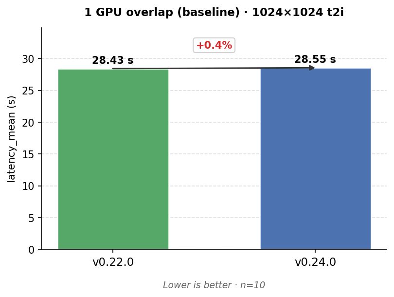
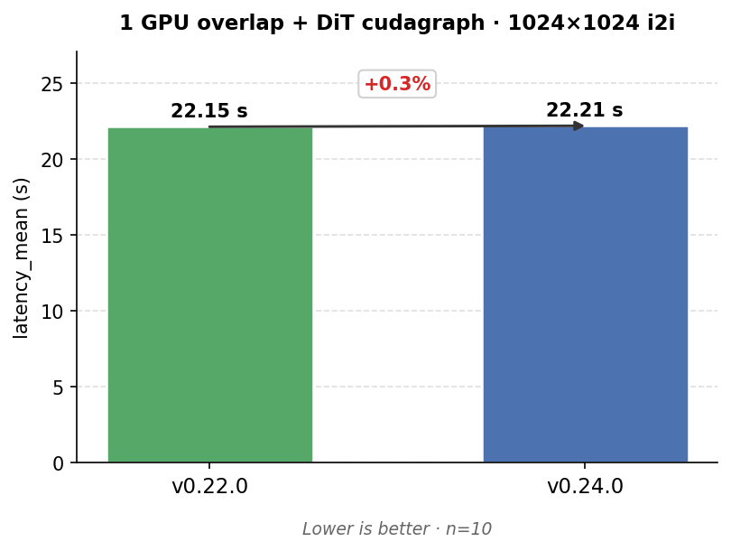
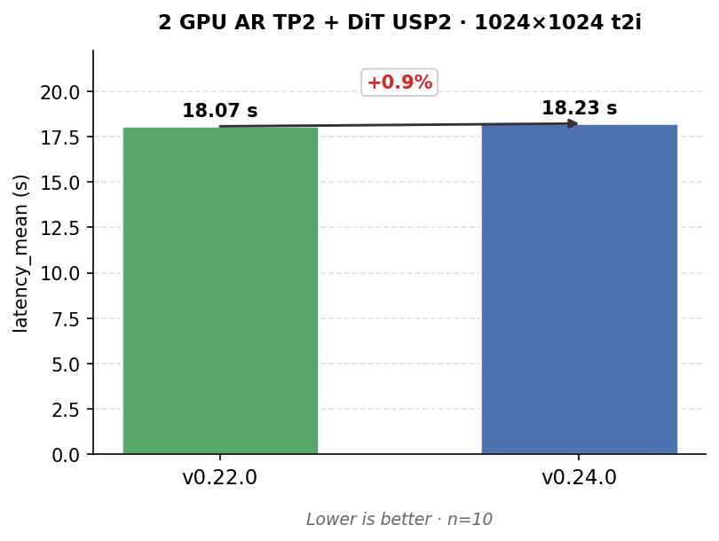
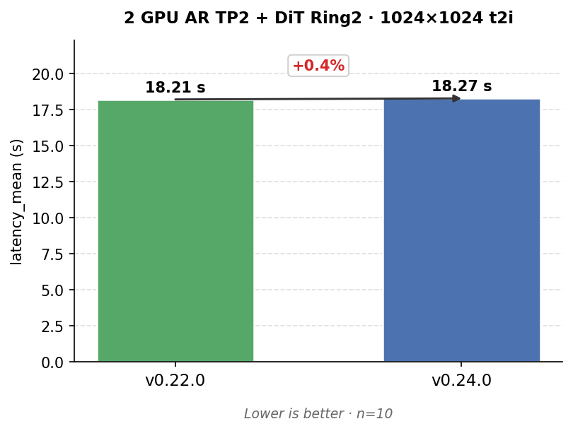
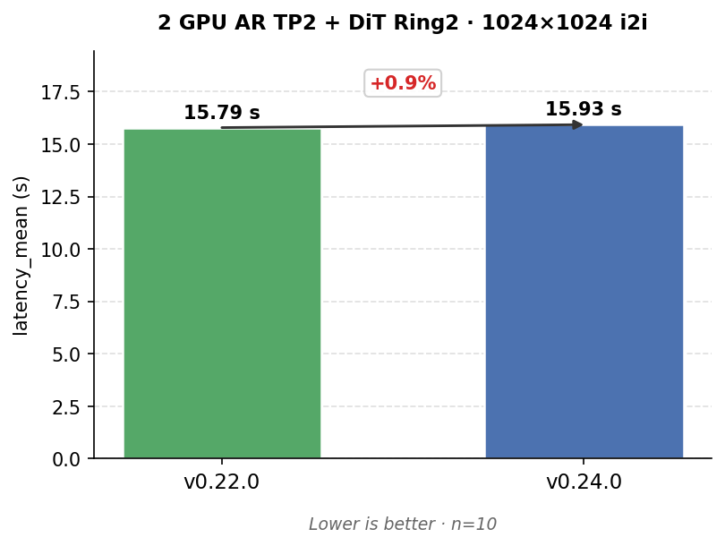
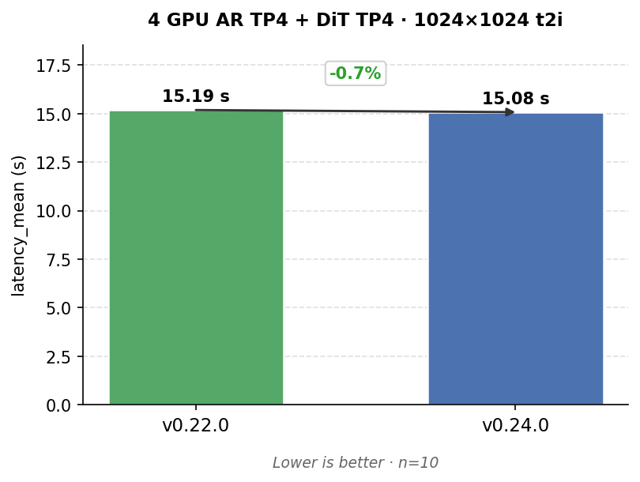
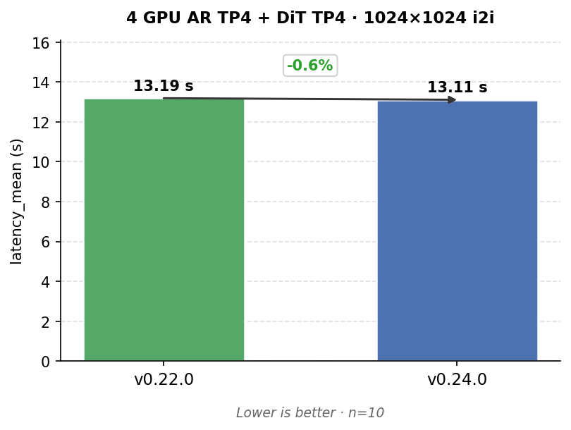
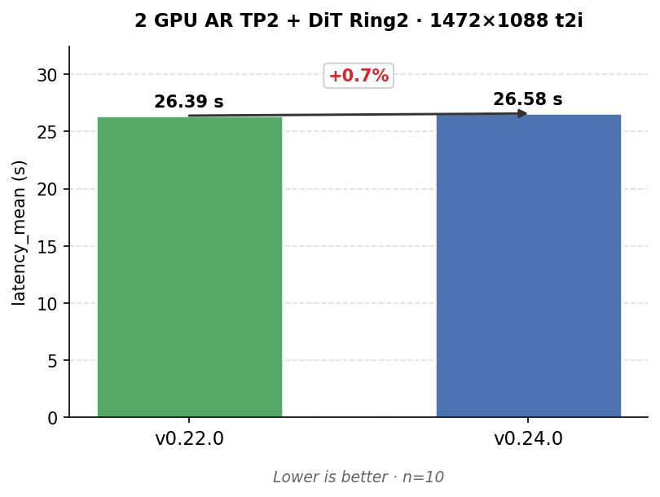
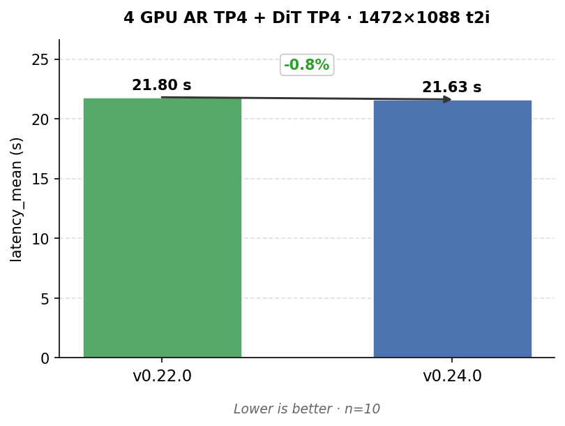

# GLM-Image

**Category:** Diffusion (text-to-image and image-to-image editing)  
**Model:** `zai-org/GLM-Image` / local checkpoint `GLM-Image`  
**Recipe:** [GLM-Image Usage Guide](https://github.com/vllm-project/recipes/blob/main/GLM/GLM-Image.md) (**TODO:** update; the current recipe predates these cookbook measurements).  
**Primary metric:** end-to-end `latency_mean` in seconds, lower is better.  
**Pipeline:** GLM-Image is served as a two-stage multi-stage pipeline: **stage 0 AR** produces image prior tokens, then **stage 1 DiT/VAE** generates the image.

This page tracks the focused GLM-Image cookbook benchmark across vLLM-Omni **v0.22.0** and **v0.24.0** (n=10). Older **v0.20** retro numbers are archived below for history only — no new v0.20 runs.

**Parallel naming:** sequence-parallel Ulysses is labeled **USP**; **Ring** is the ring-attention SP family variant. Older docs called USP “SP”.

---

## Performance tracks

| Track | Hardware | Source |
|-------|----------|--------|
| **Focused GLM matrix** | 4x NVIDIA H800 (measured) | [v0.22](v0.22/) · [v0.24](v0.24/) |
| **Runner** | pytest + OpenAI `/v1/chat/completions` | `vllm-omni/tests/dfx/perf/scripts/run_diffusion_benchmark.py` |
| **Nightly CI candidate** | 4x GPU focused matrix | `vllm-omni/tests/dfx/perf/tests/test_glm_image_vllm_omni_focused_inline.json` (TODO: push upstream and raise PR) |

## Evidence

| Field | v0.22 | v0.24 |
|-------|-------|-------|
| Release tag | `v0.22.0` | `v0.24.0` |
| Checkout SHA | `963ba1ab` | `d4a869fe` |
| Measured | n=10, 2026-07-27, **28/28 pass** | n=10, 2026-07-27, **44/44 pass** |
| Cookbook config | [`v0.22/test_glm_image_cookbook_v22_n10.json`](v0.22/test_glm_image_cookbook_v22_n10.json) | [`v0.24/test_glm_image_cookbook_v24_n10.json`](v0.24/test_glm_image_cookbook_v24_n10.json) |

Workload settings: **50 steps**, **seed=42**, **max-concurrency=1**, **num-prompts=10**, 1 warmup (1 step) before each measured item. Guidance scale remains **1.5** (CFG *math* on; CFG-*parallel* only where noted).

---

## v0.24.0

CFG-parallel hang was fixed in v0.24 ([#3956](https://github.com/vllm-project/vllm-omni/pull/3956)). An exhaustive t2i parallel search plus this n=10 matrix show **CFG-parallel as the new winner** on both 2-GPU and 4-GPU H800. USP and Ring stay within ~0.5% of each other.

| GPU group | Best config at v0.24 | 1024×1024 t2i | 1472×1088 t2i |
|-----------|----------------------|--------------:|---------------:|
| 1 GPU | `1gpu_overlap_dit_cudagraph` | **25.24 s** | **37.70 s** |
| 2 GPU | `2gpu_artp2_cfg2_dit_cudagraph` | **17.16 s** | **25.16 s** |
| 4 GPU | `4gpu_artp4_cfg2_ring2_dit_cudagraph` | **13.22 s** | **19.05 s** |

2-GPU top3 (1024 t2i): **CFG2** 17.16 → **USP2** 18.23 ≈ **Ring2** 18.27 (TP2 18.54).  
4-GPU top3 (1024 t2i): **CFG2×Ring2** 13.22 ≈ **CFG2×USP2** 13.29 → **CFG2×TP2** 13.49 (old **TP4+USP4** 13.86).

**i2i ranking:** same order as t2i except at 4 GPU, **CFG2×USP2** (11.23 s) edges **CFG2×Ring2** (11.25 s) on 1024 i2i.

<details>
<summary><strong>v0.24 parallel search notes</strong> (exhaustive t2i scout + n=10 confirmation)</summary>

- Default `glm_image.yaml`: CFG math ON (`guidance_scale: 1.5`), CFG-parallel OFF.
- CFG-parallel was broken/hang-prone before v0.24; do **not** enable it on v0.22.
- i2i + CFG-p may still have KV-cache mode issues ([#3646](https://github.com/vllm-project/vllm-omni/pull/3646) open); t2i CFG-p is the supported path for these cookbook numbers.
- HSDP helps memory, not latency, on this matrix.
- Latency across n=10 is stable for multi-GPU configs (p95−p50 typically &lt;2% of mean). 1-GPU 1472 i2i is noisier.

</details>

**Notes**

1. **Default 2-GPU split (not in matrix).** Stock AR@GPU0 + DiT@GPU1 is near or slightly worse than colocated 1-GPU cudagraph on H800 — not recommended when one GPU fits.
2. **24 GB GPUs.** Prefer 2-GPU; prefer TP over USP/Ring when per-GPU footprint matters more than latency.
3. **v0.22 CFG cells** are marked broken / left blank — CFG-parallel was not usable there.

---

## H800 Retro Comparison (v0.22 → v0.24, n=10)

Measured on **4x NVIDIA H800**. Δ format: percent then `(v0.22 -> v0.24)`. v0.22 CFG-parallel cells are marked *broken* (not runnable on v0.22).

Config naming: `*_dit_cudagraph` ⇒ stage 1 `enforce_eager: false`. Stage 0 AR is already non-eager in all focused configs.

### 1024×1024

| Config | t2i v0.22 | t2i v0.24 | Δ t2i | i2i v0.22 | i2i v0.24 | Δ i2i |
|---|---:|---:|---:|---:|---:|---:|
| `1 GPU overlap (baseline)` | 28.43 | 28.55 | ~+0.4%<br>(28.43 -> 28.55) | 25.49 | 25.55 | ~+0.3%<br>(25.49 -> 25.55) |
| `1 GPU overlap + DiT cudagraph` | 25.10 | 25.24 | ~+0.6%<br>(25.10 -> 25.24) | 22.15 | 22.21 | ~+0.3%<br>(22.15 -> 22.21) |
| `2 GPU AR TP2 + DiT USP2` | 18.07 | 18.23 | ~+0.9%<br>(18.07 -> 18.23) | 15.73 | 15.86 | ~+0.8%<br>(15.73 -> 15.86) |
| `2 GPU AR TP2 + DiT TP2` | 18.70 | 18.54 | ~−0.8%<br>(18.70 -> 18.54) | 16.38 | 16.18 | ~−1.2%<br>(16.38 -> 16.18) |
| `2 GPU AR TP2 + DiT Ring2` | 18.21 | 18.27 | ~+0.4%<br>(18.21 -> 18.27) | 15.79 | 15.93 | ~+0.9%<br>(15.79 -> 15.93) |
| `2 GPU AR TP2 + DiT CFG2` | *broken* | **17.16** | — | *broken* | **14.81** | — |
| `4 GPU AR TP4 + DiT USP4` | 13.84 | 13.86 | ~+0.2%<br>(13.84 -> 13.86) | 11.85 | 11.87 | ~+0.2%<br>(11.85 -> 11.87) |
| `4 GPU AR TP4 + DiT TP4` | 15.19 | 15.08 | ~−0.7%<br>(15.19 -> 15.08) | 13.19 | 13.11 | ~−0.6%<br>(13.19 -> 13.11) |
| `4 GPU AR TP4 + DiT CFG2×USP2` | *broken* | **13.29** | — | *broken* | **11.23** | — |
| `4 GPU AR TP4 + DiT CFG2×Ring2` | *broken* | **13.22** | — | *broken* | **11.25** | — |
| `4 GPU AR TP4 + DiT CFG2×TP2` | *broken* | 13.49 | — | *broken* | 11.43 | — |

<details>
<summary><strong>1024×1024 charts (14)</strong> — v0.22.0 vs v0.24.0 bar charts; lower is better</summary>

<table>
<tr>
<td></td>
<td></td>
</tr>
<tr>
<td></td>
<td></td>
</tr>
<tr>
<td></td>
<td></td>
</tr>
<tr>
<td></td>
<td></td>
</tr>
<tr>
<td></td>
<td></td>
</tr>
<tr>
<td></td>
<td></td>
</tr>
<tr>
<td></td>
<td></td>
</tr>
</table>

</details>

### 1472×1088

| Config | t2i v0.22 | t2i v0.24 | Δ t2i | i2i v0.22 | i2i v0.24 | Δ i2i |
|---|---:|---:|---:|---:|---:|---:|
| `1 GPU overlap (baseline)` | 42.43 | 42.48 | ~+0.1%<br>(42.43 -> 42.48) | 42.78 | 42.85 | ~+0.2%<br>(42.78 -> 42.85) |
| `1 GPU overlap + DiT cudagraph` | 37.57 | 37.70 | ~+0.3%<br>(37.57 -> 37.70) | 37.87 | 38.05 | ~+0.5%<br>(37.87 -> 38.05) |
| `2 GPU AR TP2 + DiT USP2` | 26.31 | 26.51 | ~+0.7%<br>(26.31 -> 26.51) | 24.18 | 24.33 | ~+0.6%<br>(24.18 -> 24.33) |
| `2 GPU AR TP2 + DiT TP2` | 27.42 | 27.18 | ~−0.9%<br>(27.42 -> 27.18) | 25.29 | 25.03 | ~−1.0%<br>(25.29 -> 25.03) |
| `2 GPU AR TP2 + DiT Ring2` | 26.39 | 26.58 | ~+0.7%<br>(26.39 -> 26.58) | 24.23 | 24.39 | ~+0.7%<br>(24.23 -> 24.39) |
| `2 GPU AR TP2 + DiT CFG2` | *broken* | **25.16** | — | *broken* | **23.05** | — |
| `4 GPU AR TP4 + DiT USP4` | 19.58 | 19.63 | ~+0.2%<br>(19.58 -> 19.63) | 17.64 | 17.74 | ~+0.6%<br>(17.64 -> 17.74) |
| `4 GPU AR TP4 + DiT TP4` | 21.80 | 21.63 | ~−0.8%<br>(21.80 -> 21.63) | 19.90 | 19.73 | ~−0.8%<br>(19.90 -> 19.73) |
| `4 GPU AR TP4 + DiT CFG2×USP2` | *broken* | **19.08** | — | *broken* | **17.21** | — |
| `4 GPU AR TP4 + DiT CFG2×Ring2` | *broken* | **19.05** | — | *broken* | **17.14** | — |
| `4 GPU AR TP4 + DiT CFG2×TP2` | *broken* | 19.50 | — | *broken* | 17.59 | — |

<details>
<summary><strong>1472×1088 charts (14)</strong> — v0.22.0 vs v0.24.0 bar charts; lower is better</summary>

<table>
<tr>
<td></td>
<td></td>
</tr>
<tr>
<td></td>
<td></td>
</tr>
<tr>
<td></td>
<td></td>
</tr>
<tr>
<td></td>
<td></td>
</tr>
<tr>
<td></td>
<td></td>
</tr>
<tr>
<td></td>
<td></td>
</tr>
<tr>
<td></td>
<td></td>
</tr>
</table>

</details>

Ranking by GPU group (v0.24, 1024 t2i):

- 1 GPU: `1gpu_overlap_dit_cudagraph` beats `1gpu_overlap`.
- 2 GPU: `cfg2` ≫ `usp2` ≈ `ring2` ≫ `tp2`.
- 4 GPU: `cfg2_ring2` ≈ `cfg2_usp2` ≫ `cfg2_tp2` ≫ old `tp4_usp4` ≫ `tp4_tp4`.

---

<details>
<summary><strong>Archive: v0.20 → v0.22 H800 retro</strong> (prior n≈1 cookbook; no new v0.20 runs)</summary>

Measured **2026-06-08**. Naming used `SP` for what is now **USP**.

### 1024×1024 (archived)

| Config | t2i v0.20 | t2i v0.22 | Δ t2i | i2i v0.20 | i2i v0.22 | Δ i2i |
|---|---:|---:|---:|---:|---:|---:|
| `1 GPU overlap (baseline)` | 28.30 | 28.11 | ~−0.7% | 25.29 | 25.15 | ~−0.6% |
| `1 GPU overlap + DiT cudagraph` | 24.99 | 24.87 | ~−0.5% | 21.94 | 21.85 | ~−0.4% |
| `2 GPU AR TP2 + DiT SP2` | 18.03 | 18.09 | ~+0.3% | 15.71 | 15.74 | ~+0.1% |
| `2 GPU AR TP2 + DiT TP2` | 18.53 | 18.65 | ~+0.7% | 16.23 | 16.32 | ~+0.6% |
| `4 GPU AR TP4 + DiT SP4` | 13.82 | 13.89 | ~+0.5% | 11.85 | 11.86 | ~+0.1% |
| `4 GPU AR TP4 + DiT TP4` | 15.11 | 15.12 | ~+0.1% | 13.13 | 13.09 | ~−0.4% |

### 1472×1088 (archived)

| Config | t2i v0.20 | t2i v0.22 | Δ t2i | i2i v0.20 | i2i v0.22 | Δ i2i |
|---|---:|---:|---:|---:|---:|---:|
| `1 GPU overlap (baseline)` | 41.96 | 41.80 | ~−0.4% | 39.34 | 39.05 | ~−0.7% |
| `1 GPU overlap + DiT cudagraph` | 37.08 | 36.97 | ~−0.3% | 34.27 | 34.22 | ~−0.1% |
| `2 GPU AR TP2 + DiT SP2` | 26.15 | 26.25 | ~+0.4% | 24.10 | 24.14 | ~+0.1% |
| `2 GPU AR TP2 + DiT TP2` | 27.02 | 27.16 | ~+0.5% | 25.00 | 25.05 | ~+0.2% |
| `4 GPU AR TP4 + DiT SP4` | 19.62 | 19.57 | ~−0.3% | 17.68 | 17.61 | ~−0.4% |
| `4 GPU AR TP4 + DiT TP4` | 21.73 | 21.70 | ~−0.2% | 19.83 | 19.77 | ~−0.3% |

No GLM-Image-specific optimization work in the v0.20 → v0.22 upgrade (parity within ~1%).

</details>

---

<details>
<summary><strong>Archive: stage timing snapshot (v0.22 t2i, prior cookbook)</strong></summary>

These numbers are useful for understanding where the time goes, but they should not replace the E2E latency table. `stage_0_gen` is the AR stage; `stage_1_gen` is the DiT denoise window on stage 1; `vae_decode` is measured separately by the diffusion pipeline profiler. **E2E ≈ Stage 0 + Stage 1 + VAE decode** (within ~0.1 s). Units are seconds.

| Config | Workload | E2E | Stage 0 gen | Stage 1 gen | DiT diffuse | VAE decode |
|---|---|---:|---:|---:|---:|---:|
| `1gpu_overlap` | 1024×1024 t2i | 28.11 | 14.02 | 13.90 | 13.64 | 0.19 |
| `1gpu_overlap_dit_cudagraph` | 1024×1024 t2i | 24.87 | 14.03 | 10.65 | 10.39 | 0.19 |
| `2gpu_artp2_sp2_dit_cudagraph` | 1024×1024 t2i | 18.09 | 11.38 | 6.52 | 6.26 | 0.19 |
| `2gpu_tp2_overlap_dit_cudagraph` | 1024×1024 t2i | 18.65 | 11.33 | 7.13 | 6.87 | 0.19 |
| `4gpu_tp4_sp4_overlap_dit_cudagraph` | 1024×1024 t2i | 13.89 | 9.53 | 4.17 | 3.89 | 0.19 |
| `4gpu_tp4_tp4_overlap_dit_cudagraph` | 1024×1024 t2i | 15.12 | 9.48 | 5.44 | 5.18 | 0.19 |
| `1gpu_overlap` | 1472×1088 t2i | 41.80 | 19.68 | 21.84 | 21.46 | 0.29 |
| `1gpu_overlap_dit_cudagraph` | 1472×1088 t2i | 36.97 | 19.71 | 16.99 | 16.61 | 0.29 |
| `2gpu_artp2_sp2_dit_cudagraph` | 1472×1088 t2i | 26.25 | 15.96 | 10.08 | 9.70 | 0.29 |
| `2gpu_tp2_overlap_dit_cudagraph` | 1472×1088 t2i | 27.16 | 15.89 | 11.06 | 10.68 | 0.29 |
| `4gpu_tp4_sp4_overlap_dit_cudagraph` | 1472×1088 t2i | 19.57 | 13.37 | 5.90 | 5.51 | 0.29 |
| `4gpu_tp4_tp4_overlap_dit_cudagraph` | 1472×1088 t2i | 21.70 | 13.29 | 8.08 | 7.71 | 0.29 |

**Interpretation:** CUDA graph mainly reduces stage 1 / DiT time. USP/SP is consistently better than TP for the DiT stage in this GLM matrix, especially at 4 GPUs.

</details>

## Stage timing snapshot (v0.24 t2i, n=10)

| Config | Workload | E2E | Stage 0 gen | Stage 1 gen | DiT diffuse | VAE decode |
|---|---|---:|---:|---:|---:|---:|
| `1gpu_overlap` | 1024×1024 t2i | 28.55 | 14.14 | 14.23 | 13.96 | 0.19 |
| `1gpu_overlap_dit_cudagraph` | 1024×1024 t2i | 25.24 | 14.23 | 10.84 | 10.57 | 0.19 |
| `2gpu_artp2_usp2_dit_cudagraph` | 1024×1024 t2i | 18.23 | 11.41 | 6.62 | 6.36 | 0.19 |
| `2gpu_artp2_tp2_dit_cudagraph` | 1024×1024 t2i | 18.54 | 11.38 | 6.98 | 6.72 | 0.19 |
| `2gpu_artp2_cfg2_dit_cudagraph` | 1024×1024 t2i | 17.16 | 11.41 | 5.57 | 5.31 | 0.19 |
| `2gpu_artp2_ring2_dit_cudagraph` | 1024×1024 t2i | 18.27 | 11.41 | 6.68 | 6.42 | 0.19 |
| `4gpu_tp4_usp4_dit_cudagraph` | 1024×1024 t2i | 13.86 | 9.58 | 4.09 | 3.83 | 0.19 |
| `4gpu_tp4_tp4_dit_cudagraph` | 1024×1024 t2i | 15.08 | 9.55 | 5.35 | 5.09 | 0.19 |
| `4gpu_artp4_cfg2_usp2_dit_cudagraph` | 1024×1024 t2i | 13.29 | 9.65 | 3.45 | 3.19 | 0.19 |
| `4gpu_artp4_cfg2_ring2_dit_cudagraph` | 1024×1024 t2i | 13.22 | 9.59 | 3.46 | 3.20 | 0.19 |
| `4gpu_artp4_cfg2_tp2_dit_cudagraph` | 1024×1024 t2i | 13.49 | 9.67 | 3.63 | 3.37 | 0.19 |
| `1gpu_overlap` | 1472×1088 t2i | 42.48 | 19.82 | 22.38 | 22.01 | 0.29 |
| `1gpu_overlap_dit_cudagraph` | 1472×1088 t2i | 37.70 | 19.92 | 17.49 | 17.12 | 0.29 |
| `2gpu_artp2_usp2_dit_cudagraph` | 1472×1088 t2i | 26.51 | 15.98 | 10.23 | 9.86 | 0.29 |
| `2gpu_artp2_tp2_dit_cudagraph` | 1472×1088 t2i | 27.18 | 15.97 | 10.93 | 10.55 | 0.29 |
| `2gpu_artp2_cfg2_dit_cudagraph` | 1472×1088 t2i | 25.16 | 15.93 | 8.94 | 8.56 | 0.29 |
| `2gpu_artp2_ring2_dit_cudagraph` | 1472×1088 t2i | 26.58 | 16.02 | 10.27 | 9.89 | 0.29 |
| `4gpu_tp4_usp4_dit_cudagraph` | 1472×1088 t2i | 19.63 | 13.44 | 5.90 | 5.53 | 0.29 |
| `4gpu_tp4_tp4_dit_cudagraph` | 1472×1088 t2i | 21.63 | 13.41 | 7.92 | 7.54 | 0.29 |
| `4gpu_artp4_cfg2_usp2_dit_cudagraph` | 1472×1088 t2i | 19.08 | 13.47 | 5.31 | 4.93 | 0.29 |
| `4gpu_artp4_cfg2_ring2_dit_cudagraph` | 1472×1088 t2i | 19.05 | 13.46 | 5.30 | 4.93 | 0.29 |
| `4gpu_artp4_cfg2_tp2_dit_cudagraph` | 1472×1088 t2i | 19.50 | 13.55 | 5.66 | 5.28 | 0.29 |

**Interpretation:** CFG-parallel cuts stage-1 / DiT time further beyond USP/Ring alone (e.g. 2-GPU CFG2 DiT ~5.3 s vs USP2 ~6.4 s at 1024). CUDA graph still dominates the 1-GPU gain.

---

## 1-GPU Retro Comparison

Tracks the oldest comparable 1-GPU GLM-Image path. v0.16–v0.22 columns are the prior cookbook series; **v0.24** is the new n=10 measurement.

| Config | Task | v0.16 | v0.18 | v0.20 | v0.22 | v0.24 (n=10) |
|---|---|---:|---:|---:|---:|---:|
| `1gpu_overlap` | t2i | 39.83 | 33.63 | 28.30 | 28.11 | 28.55 |
| `1gpu_overlap` | i2i | 39.57 | not runnable | 25.29 | 25.15 | 25.55 |
| `1gpu_overlap_dit_cudagraph` | t2i | 39.55 | 29.95 | 24.99 | 24.87 | 25.24 |
| `1gpu_overlap_dit_cudagraph` | i2i | 39.40 | not runnable | 21.94 | 21.85 | 22.21 |

v0.18 i2i starts the server but fails before generation in the stock `/v1/chat/completions` multimodal preprocessing path. Keep it as `not runnable` for an unpatched retro run; relevant fixes include [#2320](https://github.com/vllm-project/vllm-omni/pull/2320), [#3024](https://github.com/vllm-project/vllm-omni/pull/3024), and [#3189](https://github.com/vllm-project/vllm-omni/pull/3189).

Small v0.22→v0.24 1-GPU deltas (~+1–2%) are within run-to-run noise for this matrix; multi-GPU CFG-parallel is the meaningful v0.24 story.

---

## Release index

| Release | GLM-Image highlight | Relevant PRs |
|---------|---------------------|--------------|
| [v0.24.0](https://github.com/vllm-project/vllm-omni/releases/tag/v0.24.0) | CFG-parallel hang fix lands; H800 search finds CFG2 (2-GPU) and CFG2×Ring2/USP2 (4-GPU) as new latency winners over prior USP/SP cookbook picks. | CFG-p hang fix [#3956](https://github.com/vllm-project/vllm-omni/pull/3956); i2i KV-mode follow-up [#3646](https://github.com/vllm-project/vllm-omni/pull/3646) (open) |
| [v0.22.0](https://github.com/vllm-project/vllm-omni/releases/tag/v0.22.0) | Covers GLM-Image work after v0.20 and before/at v0.22. Fresh H800 focused run stays within ~1% of v0.20; recipe added; W4A16 AutoRound and L4 feature coverage land. CFG-parallel not usable. | recipe [#2950](https://github.com/vllm-project/vllm-omni/pull/2950), AutoRound W4A16 [#3059](https://github.com/vllm-project/vllm-omni/pull/3059), NPU stage env/config [#3235](https://github.com/vllm-project/vllm-omni/pull/3235), L4 feature e2e [#3451](https://github.com/vllm-project/vllm-omni/pull/3451) |
| [v0.20.0](https://github.com/vllm-project/vllm-omni/releases/tag/v0.20.0) | Main GLM-Image serving/perf stack matures: SP/USP, HSDP, Cache-DiT, quantization, image-edit fixes, config refactor, benchmark/bugfix work. | Cache-DiT [#1399](https://github.com/vllm-project/vllm-omni/pull/1399), SP [#1983](https://github.com/vllm-project/vllm-omni/pull/1983), HSDP [#2029](https://github.com/vllm-project/vllm-omni/pull/2029), quantization [#2292](https://github.com/vllm-project/vllm-omni/pull/2292), output dims / image edit [#2320](https://github.com/vllm-project/vllm-omni/pull/2320), config refactor [#2977](https://github.com/vllm-project/vllm-omni/pull/2977), benchmark + bugfix [#3024](https://github.com/vllm-project/vllm-omni/pull/3024), online generation fix [#3084](https://github.com/vllm-project/vllm-omni/pull/3084), t2i multimodal routing [#3189](https://github.com/vllm-project/vllm-omni/pull/3189), processor cache [#3245](https://github.com/vllm-project/vllm-omni/pull/3245) |
| [v0.18.0](https://github.com/vllm-project/vllm-omni/releases/tag/v0.18.0) | GLM-Image stage config and TP support become available in an even stable release. | diffusers-format stage config [#1894](https://github.com/vllm-project/vllm-omni/pull/1894), TP [#1918](https://github.com/vllm-project/vllm-omni/pull/1918) |
| [v0.16.0](https://github.com/vllm-project/vllm-omni/releases/tag/v0.16.0) | Initial tracked stable GLM-Image release-line baseline. | GLM Image perf/model support [#920](https://github.com/vllm-project/vllm-omni/pull/920) |

Notes:

- Non-TP diffusion CLI flags for multi-stage GLM-Image are still tracked in [issue #4040](https://github.com/vllm-project/vllm-omni/issues/4040); prefer deploy YAML / `deploy-config-inline` for multi-stage parallel configs.

## Standardized focused perf test

The focused matrix uses two resolutions, both with **50 inference steps**, **seed=42**, **max-concurrency=1**. Cookbook release comparisons use **num-prompts=10**; the older CI-candidate JSON may still use `num-prompts=1`. The benchmark runner performs **1 warmup request** with **1 inference step** before each measured item.

| Workload | Task | Notes |
|----------|------|-------|
| `1024x1024_t2i_steps50` | t2i | primary cookbook baseline |
| `1024x1024_i2i_steps50` | i2i | image-to-image editing at baseline resolution |
| `1472x1088_t2i_steps50` | t2i | higher-resolution GLM-Image workload |
| `1472x1088_i2i_steps50` | i2i | image-to-image editing at higher resolution |

Perf command (n=10 cookbook configs):

```bash
cd /path/to/vllm-omni
export CUDA_VISIBLE_DEVICES=0,1,2,3
export VLLM_WORKER_MULTIPROC_METHOD=spawn
export DIFFUSION_BENCHMARK_DIR=/path/to/output/perf_results

python -m pytest -s tests/dfx/perf/scripts/run_diffusion_benchmark.py \
  --test-config-file /path/to/cookbook/diffusion/glm-image/v0.24/test_glm_image_cookbook_v24_n10.json
```

## Version-specific config notes

### v0.24.0

- [`v0.24/test_glm_image_cookbook_v24_n10.json`](v0.24/test_glm_image_cookbook_v24_n10.json) — 11 configs × 4 workloads (includes CFG-parallel winners).
- [`v0.24/glm_image_1024_1472x1088_steps50_t2i_i2i_n10.json`](v0.24/glm_image_1024_1472x1088_steps50_t2i_i2i_n10.json)

### v0.22.0

- [`v0.22/test_glm_image_cookbook_v22_n10.json`](v0.22/test_glm_image_cookbook_v22_n10.json) — 7 configs × 4 workloads (**no CFG-parallel**).
- [`v0.22/test_glm_image_vllm_omni_focused_inline.json`](v0.22/test_glm_image_vllm_omni_focused_inline.json) — prior focused CI candidate (SP naming).

### v0.20.0 (archived)

v0.20 serve CLI does **not** support `deploy-config-inline`; use local `--deploy-config` YAML. See [`v0.20/`](v0.20/) — no new measurements in this cycle.

## v0.24 Serve Commands

Use `vllm-omni serve` or `python -m vllm_omni.entrypoints.cli.main serve`. Prefer deploy YAML / inline deploy for multi-stage USP/Ring/CFG.

### Recommended 2-GPU: AR TP2 + DiT CFG2

```yaml
async_chunk: false
stages:
  - stage_id: 0
    devices: "0,1"
    tensor_parallel_size: 2
    enforce_eager: false
    gpu_memory_utilization: 0.6
    # ... AR sampling params ...
  - stage_id: 1
    devices: "0,1"
    enforce_eager: false
    parallel_config:
      tensor_parallel_size: 1
      cfg_parallel_size: 2
    # guidance_scale: 1.5, steps: 50, ...
```

### Recommended 4-GPU: AR TP4 + DiT CFG2×Ring2 (or CFG2×USP2)

```yaml
parallel_config:
  tensor_parallel_size: 1
  cfg_parallel_size: 2
  sequence_parallel_size: 2
  ulysses_degree: 1   # Ring2: ring_degree=2, ulysses_degree=1
  ring_degree: 2      # USP2:  ulysses_degree=2, ring_degree=1
```

For the prior USP-only 2-GPU recipe (still strong, ~6% behind CFG2), use `ulysses_degree: 2` / `ring_degree: 1` without `cfg_parallel_size`.

---

## Related tests and artifacts

| Location | Path | Role |
|----------|------|------|
| Cookbook | `diffusion/glm-image/v0.24/` | v0.24 n=10 JSON + result summary |
| Cookbook | `diffusion/glm-image/v0.22/` | v0.22 n=10 JSON (+ prior focused CI candidate) |
| Cookbook | `diffusion/glm-image/v0.20/` | archived v0.20 focused JSON |
| Cookbook | `diffusion/glm-image/scripts/generate_h800_retro_charts.py` | v0.22 vs v0.24 bar charts |
| vLLM-Omni | `tests/e2e/online_serving/test_glm_image_expansion.py` | L4 feature e2e |
| vLLM-Omni | `benchmarks/glm_image/` | Manual HF / offline / online scripts |
