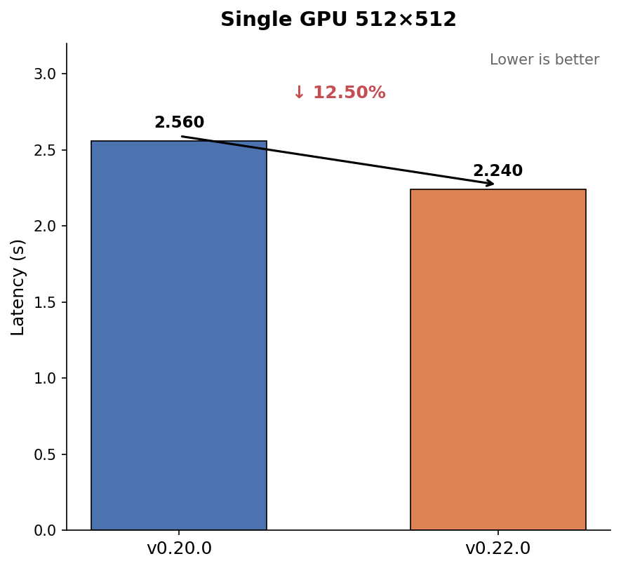
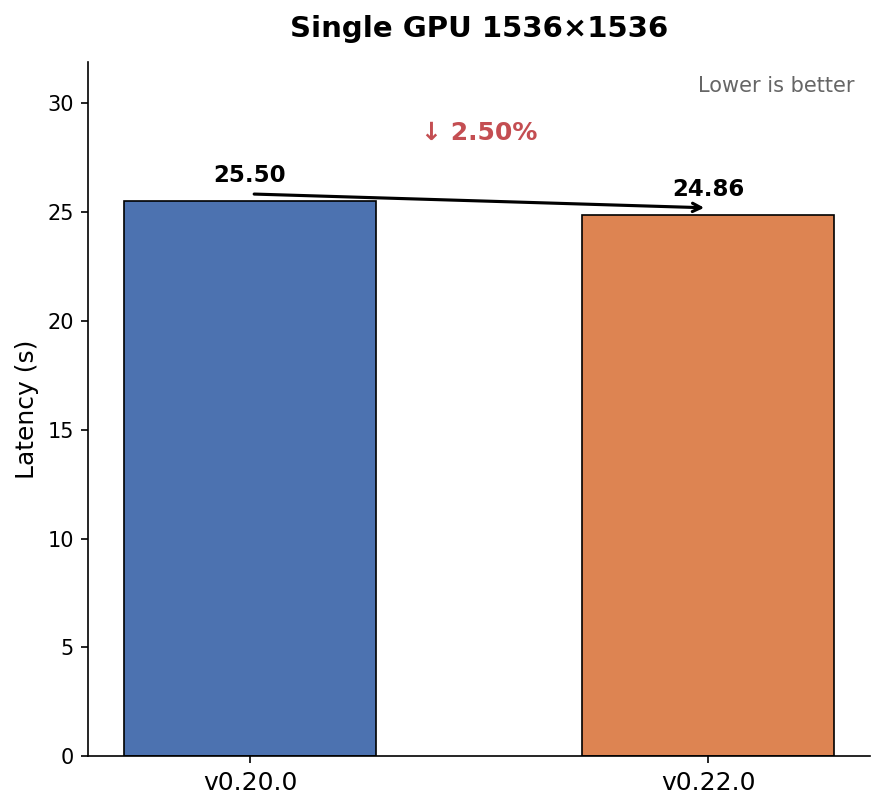
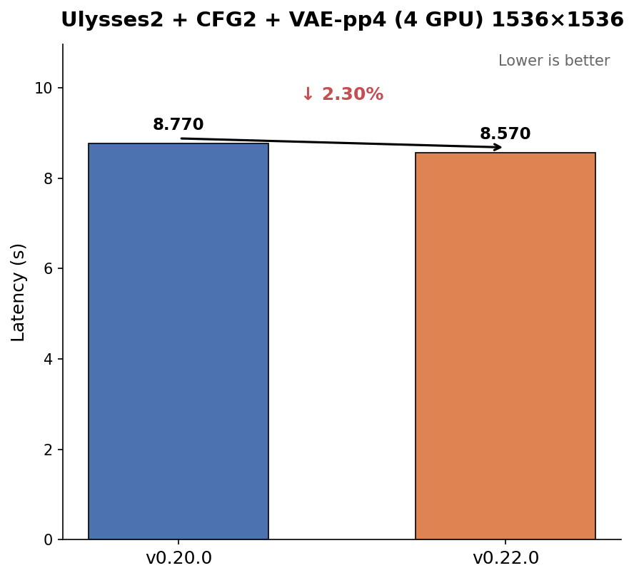

# Qwen-Image

**Category:** Diffusion (text-to-image)  
**Model:** `Qwen/Qwen-Image`  
**Recipe:** [Qwen-Image](https://github.com/vllm-project/vllm-omni/blob/main/recipes/Qwen/Qwen-Image.md)  
**Serving dashboard:** [qwen_image_serving_performance.md](https://github.com/vllm-project/vllm-omni/blob/main/benchmarks/diffusion/performance_dashboard/qwen_image_serving_performance.md)

Retro benchmark harness (v0.18 / v0.20): `vllm-omni/benchmark_results/qwen_image_retro/`.

---

## Performance tracks

| Track | Hardware | Source |
|-------|----------|--------|
| **Standardized T2I (CI)** | 2× H100 (nightly) | [`test_qwen_image_vllm_omni.json`](https://github.com/vllm-project/vllm-omni/blob/main/tests/dfx/perf/tests/test_qwen_image_vllm_omni.json) |
| **v0.18 / v0.20 / v0.22 retro** | 4× H200 (measured) | [Table below](#h200-retro-comparison) |

---

## Standardized perf test (CI)

| `test_name` | Workload | CI `latency_mean` (H100) |
|-------------|----------|--------------------------|
| `test_qwen_image_single_device` | 512×512, 20 steps | **3.50 s** |
| same | 1536×1536, 35 steps | **27.0 s** |
| `test_qwen_image_ulysses2_cfg2_vae_patch4` | 1536×1536, 35 steps | **9.1 s** |

Full JSON includes `step_execution` and `cache_dit` cases — retro subset uses **single_device + ulysses2** only.

```bash
cd /path/to/vllm-omni
export CUDA_VISIBLE_DEVICES=0,1,2,3 DIFFUSION_ATTENTION_BACKEND=FLASH_ATTN VLLM_WORKER_MULTIPROC_METHOD=spawn
pytest -s tests/dfx/perf/scripts/run_diffusion_benchmark.py \
  --test-config-file tests/dfx/perf/tests/test_qwen_image_vllm_omni.json
```

---

## H200 retro comparison

Measured **2026-06-09** on **4× NVIDIA H200** (v0.20 / v0.22 reruns). v0.18.0 numbers from **2026-05-22** retro on the same hardware class. Metric: **`latency_mean`** (seconds, lower is better).

Protocol: subset of [`test_qwen_image_vllm_omni.json`](https://github.com/vllm-project/vllm-omni/blob/main/tests/dfx/perf/tests/test_qwen_image_vllm_omni.json) — **`num-prompts=3`**, **`warmup-requests=1`** (first request excluded from measurement — avoids `torch.compile` / resolution-transition inflation). Checkpoint: **`Qwen/Qwen-Image`** across all versions.

| Config | Workload | v0.18.0† | v0.20.0 (`4a24a51`) | v0.22.0 (`963ba1a`) | Δ v0.20→v0.22 |
|--------|----------|----------|---------------------|---------------------|---------------|
| Single device | 512×512, 20 steps | **2.20** | 2.56 | **2.24** | −12.5% |
| Single device | 1536×1536, 35 steps | **23.96** | 25.50 | **24.86** | −2.5% |
| Ulysses2 + CFG2 + VAE-pp4 | 1536×1536, 35 steps | **8.16** | 8.77 | **8.57** | −2.3% |

† v0.18.0 measured 2026-05-22; v0.20.0 / v0.22.0 measured 2026-06-09 on the same retro protocol.

**Takeaway:** **v0.22.0** is faster than **v0.20.0** on all three measured H200 T2I workloads, with roughly **2–13%** lower mean latency. The largest gain is on the 512×512 single-device path (−12.5%), driven mainly by switching from vLLM RMSNorm to torch RMSNorm ([#4074](https://github.com/vllm-project/vllm/pull/4074)). **v0.18.0** remains fastest on 1536×1536 single-device and USP2 vs the v0.20/v0.22 pair.

### v0.22.0 vs v0.20.0 — latency_mean (s)

4× H200 · same retro protocol · lower is better.

| Config | Workload | v0.20.0 | v0.22.0 | Δ |
|--------|----------|--------:|--------:|--:|
| Single device | 512×512, 20 steps | 2.56 | **2.24** | **−12.5%** |
| Single device | 1536×1536, 35 steps | 25.50 | **24.86** | **−2.5%** |
| Ulysses2 + CFG2 + VAE-pp4 | 1536×1536, 35 steps | 8.77 | **8.57** | **−2.3%** |







**Stacks:**

| Source | vLLM-Omni | vLLM | API path |
|--------|-----------|------|----------|
| v0.18.0 tag | 0.18.0 | 0.18.0 | `vllm-omni` |
| v0.20.0 `4a24a51` | 0.20.0 | 0.20.0 | `/v1/chat/completions` |
| v0.22.0 `963ba1a` | 0.22.0 | 0.22.0 | `/v1/chat/completions` |

**Artifacts (v0.20 / v0.22 reruns, not copied into cookbook repo):**

- v0.20.0: `benchmark_results/qwen_image_retro/v0.20.0/result.json`
- v0.22.0: `benchmark_results/qwen_image_retro/v0.22.0/result.json`

> **Note:** v0.16.0 is omitted — no upstream perf JSON, different `openai` backend, SDPA fallback, and incomplete parallel CLI. Not comparable to v0.18/v0.20.

---

## Serve commands (matches perf JSON)

**Single device:**

```bash
export DIFFUSION_ATTENTION_BACKEND=FLASH_ATTN
vllm serve Qwen/Qwen-Image --omni --enable-diffusion-pipeline-profiler
```

**Ulysses2 + CFG2 + VAE-pp4 (4 GPUs):**

```bash
export CUDA_VISIBLE_DEVICES=0,1,2,3 DIFFUSION_ATTENTION_BACKEND=FLASH_ATTN VLLM_WORKER_MULTIPROC_METHOD=spawn
vllm serve Qwen/Qwen-Image --omni \
  --ulysses-degree 2 --cfg-parallel-size 2 --vae-patch-parallel-size 4 --vae-use-tiling \
  --enable-diffusion-pipeline-profiler
```

---

## Related models

| Model | Perf JSON |
|-------|-----------|
| Qwen-Image-Edit (latest) | [qwen-image-edit](../qwen-image-edit/index.md) · `test_qwen_image_edit_2511_vllm_omni.json` |
| Qwen-Image-Edit (legacy, not included) | `test_qwen_image_edit_vllm_omni.json` |
| Qwen-Image-Layered | `test_qwen_image_layered_vllm_omni.json` |

Use the same `diffusion-perf-cookbook` skill to scaffold retro for these models.
