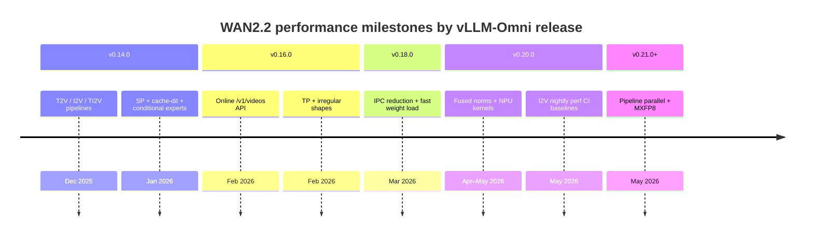

# WAN2.2

**Category:** Diffusion (image / video generation)  
**Models:** `Wan-AI/Wan2.2-T2V-A14B-Diffusers`, `Wan-AI/Wan2.2-I2V-A14B-Diffusers`, `Wan-AI/Wan2.2-TI2V-5B-Diffusers`, Wan2.2-S2V  
**Recipes (vLLM-Omni):**

- [Wan2.2 I2V](https://github.com/vllm-project/vllm-omni/blob/main/recipes/Wan-AI/Wan2.2-I2V.md)
- [Wan2.2 S2V](https://github.com/vllm-project/vllm-omni/blob/main/recipes/Wan-AI/Wan2.2-S2V.md)
- [Serving performance dashboard](https://github.com/vllm-project/vllm-omni/blob/main/benchmarks/diffusion/performance_dashboard/wan_2_2_serving_performance.md)

Diffusion Transformer (DiT) family for text-to-video, image-to-video, text-image-to-video, and speech-to-video. The 14B variants use a **dual-transformer MoE cascade** (low-noise / high-noise experts).

## Hardware Baselines

| Track | Hardware | Primary workloads |
|-------|----------|-------------------|
| **GPU nightly** | NVIDIA H100 80GB | I2V perf regression (`test_wan22_i2v_vllm_omni.json`) |
| **GPU dashboard** | NVIDIA A100-SXM4-80GB | T2V serving (`wan_2_2_serving_performance.md`) |
| **NPU** | 8× Ascend A2 / A3 | I2V/T2V with mindie-sd + MXFP8 ([recipe](https://github.com/vllm-project/vllm-omni/blob/main/recipes/Wan-AI/Wan2.2-I2V.md#npu)) |

Record **CFG**, **USP** (`--usp`), **TP**, **HSDP**, and **VAE patch parallel** when comparing numbers across releases.

## Release timeline (overview)



PRs below are grouped by the **first stable tag** that contains them ([vLLM-Omni releases](https://github.com/vllm-project/vllm-omni/releases)).

---

## v0.21.0 (upcoming)

Changes on `main` after [v0.20.0](https://github.com/vllm-project/vllm-omni/releases/tag/v0.20.0) (2026-05-07). Performance not yet recorded in this cookbook.

### Performance

| Metric | Value | Delta from v0.20.0 |
|--------|-------|---------------------|
| I2V E2E latency (832×480, 4 steps) | — | — |
| T2V mean latency (480p dashboard) | — | — |

### Optimization Notes

| PR | Summary |
|----|---------|
| [#2322](https://github.com/vllm-project/vllm-omni/pull/2322) | **Pipeline parallelism** integrated into Wan 2.2 (layer split across PP stages) |
| [#3140](https://github.com/vllm-project/vllm-omni/pull/3140) | **MXFP8 W8A8** online/offline quantization for T2V / I2V / TI2V on Ascend NPU |
| [#2640](https://github.com/vllm-project/vllm-omni/pull/2640) | Online FP8 quantization for flash attention on NPU |
| [#3271](https://github.com/vllm-project/vllm-omni/pull/3271) | Wan2.2-I2V GPU recipe updates (8× H100/A100/H20) |
| [#3463](https://github.com/vllm-project/vllm-omni/pull/3463) | ROCm wan22 bugfix |

### In progress (targeting post-v0.20.0)

| PR | Topic |
|----|-------|
| [#3127](https://github.com/vllm-project/vllm-omni/pull/3127) | Remove redundant `empty_cache` on NPU |
| [#3145](https://github.com/vllm-project/vllm-omni/pull/3145) | VAE `blend_v` / `blend_h` optimization |
| [#3270](https://github.com/vllm-project/vllm-omni/pull/3270) | Triton fused AdaLN (WIP) |
| [#3111](https://github.com/vllm-project/vllm-omni/pull/3111) | VAE tiling interfaces |
| [#2920](https://github.com/vllm-project/vllm-omni/pull/2920) | Online FP8 `quant_config` wiring (GPU) |

### Figures

_None yet._

---

## v0.20.0 (2026-05-07)

[v0.20.0 release](https://github.com/vllm-project/vllm-omni/releases/tag/v0.20.0) — first cookbook release with **measured** GPU baselines. Major themes: **fused DiT kernels** (GPU + NPU), **pipeline refactor**, **preprocess / VAE fixes**, **S2V**, **nightly perf regression**.

### Performance

Model: `Wan-AI/Wan2.2-I2V-A14B-Diffusers`  
Workload: random dataset, **832×480**, **81 frames**, **4 steps**, concurrency **1**, negative prompt enabled.

| Config | E2E latency (mean) | Throughput | Peak GPU memory (mean) | Delta from v0.18.0 |
|--------|-------------------|------------|------------------------|---------------------|
| Single device | **26.0 s** | 0.034 qps | ~80 GB | — (first measured) |
| USP=2, VAE-pp=2, HSDP, VAE slicing | **21.6 s** | 0.042 qps | ~55 GB | — (first measured) |

1280×720, 121 frames, 4 steps (USP=2, VAE-pp=2, HSDP, slicing): **101.6 s** mean.

Source: [`test_wan22_i2v_vllm_omni.json`](https://github.com/vllm-project/vllm-omni/blob/main/tests/dfx/perf/tests/test_wan22_i2v_vllm_omni.json) ([#3063](https://github.com/vllm-project/vllm-omni/pull/3063)).

**T2V dashboard** (`Wan-AI/Wan2.2-T2V-A14B-Diffusers`, A100, CFG=2, USP=2, HSDP=On):

| Dataset | VAE parallel | Mean latency | Delta vs VAE-pp=1 (same dataset) |
|---------|--------------|--------------|----------------------------------|
| 480p, 3 steps | 1 → **4** | 24.68 s → **21.68 s** | **−12%** |
| 720p, 6 steps | 1 → **4** | 124.66 s → **117.44 s** | **−6%** |

Source: [`wan_2_2_serving_performance.md`](https://github.com/vllm-project/vllm-omni/blob/main/benchmarks/diffusion/performance_dashboard/wan_2_2_serving_performance.md).

**NPU (recipe guidance, not in CI JSON):** Laser Attention up to **~40%** at 720p; mindie-sd fused norms ([#3067](https://github.com/vllm-project/vllm-omni/pull/3067)).

### Optimization Notes

_New in v0.20.0 (vs v0.18.0):_

| PR | Platform | Summary |
|----|----------|---------|
| [#2393](https://github.com/vllm-project/vllm-omni/pull/2393) | Both | Optimize rotary embedding |
| [#2459](https://github.com/vllm-project/vllm-omni/pull/2459) | GPU | Skip Ulysses SP on short cross-attention |
| [#2391](https://github.com/vllm-project/vllm-omni/pull/2391) | Both | I2V VAE FP32 → BF16 |
| [#2583](https://github.com/vllm-project/vllm-omni/pull/2583) | GPU | Fused RMSNorm |
| [#2585](https://github.com/vllm-project/vllm-omni/pull/2585) | GPU | Fused AdaLayerNorm |
| [#2575](https://github.com/vllm-project/vllm-omni/pull/2575) | NPU | AdaLayerNorm (mindie-sd) |
| [#2576](https://github.com/vllm-project/vllm-omni/pull/2576) | NPU | RMSNorm (mindie-sd) |
| [#2571](https://github.com/vllm-project/vllm-omni/pull/2571) | NPU | Fused RoPE + RoPE cache |
| [#3067](https://github.com/vllm-project/vllm-omni/pull/3067) | NPU | Fused RMSNorm replaces `WanRMS_norm` |
| [#3400](https://github.com/vllm-project/vllm-omni/pull/3400) | NPU | Reliable `WanRMS_norm` diffusers patch |
| [#2969](https://github.com/vllm-project/vllm-omni/pull/2969) | NPU | VAE parallel `gather` → `all_gather` (−480ms–1.5s) |
| [#2672](https://github.com/vllm-project/vllm-omni/pull/2672) | Both | Refactor diffusion pipelines + unit tests |
| [#2852](https://github.com/vllm-project/vllm-omni/pull/2852) | GPU | Free GPU during I2V image preprocess |
| [#2963](https://github.com/vllm-project/vllm-omni/pull/2963) | Both | Remove duplicate video preprocess |
| [#2134](https://github.com/vllm-project/vllm-omni/pull/2134) | Both | LightX2V offline conversion for I2V-A14B |
| [#2751](https://github.com/vllm-project/vllm-omni/pull/2751) | Both | Wan2.2-S2V modeling |
| [#3327](https://github.com/vllm-project/vllm-omni/pull/3327) | GPU | Flash Attention / CUBLAS fix |
| [#2919](https://github.com/vllm-project/vllm-omni/pull/2919) | NPU | Ascend I2V recipe (A2/A3) |
| [#3063](https://github.com/vllm-project/vllm-omni/pull/3063) | CI | Wan22 I2V perf nightly + JSON baselines |
| [#2817](https://github.com/vllm-project/vllm-omni/pull/2817) | CI | Stability tests for wan2.2 |
| [#2972](https://github.com/vllm-project/vllm-omni/pull/2972) | CI | L5 reliability tests |

### Figures

_None yet._

---

## v0.18.0 (2026-03-28)

[v0.18.0 release](https://github.com/vllm-project/vllm-omni/releases/tag/v0.18.0) — focus on **online serving latency** and **operational reliability** for Wan2.2 at scale.

### Performance

| Metric | Value | Delta from v0.16.0 |
|--------|-------|---------------------|
| I2V E2E latency | — | Not measured in cookbook |
| Online I2V e2e (one config, [#1715](https://github.com/vllm-project/vllm-omni/pull/1715)) | **37.5s → 31.0s** | **−17.5%** (IPC overhead removed) |
| 14B I2V weight load time | ~5 min → faster | Multi-thread shard load ([#1504](https://github.com/vllm-project/vllm-omni/pull/1504)) |

### Optimization Notes

_New in v0.18.0 (vs v0.16.0):_

| PR | Summary |
|----|---------|
| [#1715](https://github.com/vllm-project/vllm-omni/pull/1715) | Reduce IPC overhead for single-stage Wan2.2 online serving |
| [#1504](https://github.com/vllm-project/vllm-omni/pull/1504) | Multi-thread parallel safetensors loading at startup |
| [#1392](https://github.com/vllm-project/vllm-omni/pull/1392) | cache-dit fix for single-transformer TI2V-5B |
| [#1979](https://github.com/vllm-project/vllm-omni/pull/1979) | Align offline vs online diffusion config (Wan2.2) |
| [#2087](https://github.com/vllm-project/vllm-omni/pull/2087) | L4 complete diffusion feature tests for Wan2.2 |

### Figures

_None._

---

## v0.16.0 (2026-02-28)

[v0.16.0 release](https://github.com/vllm-project/vllm-omni/releases/tag/v0.16.0) — Wan2.2 becomes **production-servable**: OpenAI-compatible video API, tensor parallelism, HSDP.

### Performance

| Metric | Value | Delta from v0.14.0 |
|--------|-------|---------------------|
| E2E latency | — | Not measured in cookbook |

### Optimization Notes

_New in v0.16.0 (vs v0.14.0):_

| PR | Summary |
|----|---------|
| [#1073](https://github.com/vllm-project/vllm-omni/pull/1073) | Online T2V / I2V via OpenAI `/v1/videos` API |
| [#964](https://github.com/vllm-project/vllm-omni/pull/964) | Tensor parallelism for 14B Wan2.2 DiT |
| [#1279](https://github.com/vllm-project/vllm-omni/pull/1279) | Irregular output shapes |
| [#1221](https://github.com/vllm-project/vllm-omni/pull/1221) | TI2V warmup / `support_image_input` fix |
| [#1339](https://github.com/vllm-project/vllm-omni/pull/1339) | HSDP for diffusion models (used in Wan recipes) |

_Already present in v0.14.0 and unchanged in scope:_ CFG parallel ([#851](https://github.com/vllm-project/vllm-omni/pull/851)), Ulysses SP ([#966](https://github.com/vllm-project/vllm-omni/pull/966)), cache-dit ([#1021](https://github.com/vllm-project/vllm-omni/pull/1021)), conditional expert loading ([#980](https://github.com/vllm-project/vllm-omni/pull/980)), VAE patch parallel ([#756](https://github.com/vllm-project/vllm-omni/pull/756)).

### Figures

_None._

---

## v0.14.0 (2026-01-31) — Initial stable support

[v0.14.0 release](https://github.com/vllm-project/vllm-omni/releases/tag/v0.14.0) — **first stable release** shipping Wan2.2 T2V, I2V, and TI2V pipelines.

### Performance

| Metric | Value |
|--------|-------|
| E2E latency | — (baseline not measured) |

### Optimization Notes

| PR | Summary |
|----|---------|
| [#202](https://github.com/vllm-project/vllm-omni/pull/202) | Wan2.2 text-to-video pipeline |
| [#329](https://github.com/vllm-project/vllm-omni/pull/329) | Wan2.2 image-to-video + text-image-to-video |
| [#966](https://github.com/vllm-project/vllm-omni/pull/966) | Ulysses sequence parallelism |
| [#980](https://github.com/vllm-project/vllm-omni/pull/980) | Conditional dual-transformer loading (MoE) |
| [#1021](https://github.com/vllm-project/vllm-omni/pull/1021) | Cache-DiT step caching |
| [#851](https://github.com/vllm-project/vllm-omni/pull/851) | CFG parallel abstraction |
| [#858](https://github.com/vllm-project/vllm-omni/pull/858) | Layerwise CPU offloading (DiT) |
| [#804](https://github.com/vllm-project/vllm-omni/pull/804) | UniPC scheduler for Wan 2.2 |
| [#791](https://github.com/vllm-project/vllm-omni/pull/791) | I2V warmup fix |

### Figures

_None._

---

## Appendix: GPU vs NPU deployment

| Dimension | GPU (CUDA) | NPU (Ascend) |
|-----------|------------|--------------|
| Fused ops (v0.20.0+) | In-repo RMSNorm / AdaLN | mindie-sd + [#3067](https://github.com/vllm-project/vllm-omni/pull/3067) |
| Quantization (v0.21.0+) | FP8 in progress | **MXFP8** ([#3140](https://github.com/vllm-project/vllm-omni/pull/3140)) |
| 8-card I2V + CFG | `--cfg-parallel-size 2 --usp 4` | `--cfg 2 --usp 4` |
| Extra env | — | `MINDIE_SD_FA_TYPE=ascend_laser_attention`, `MULTI_STREAM_MEMORY_REUSE=2` |

**8× GPU (official I2V + CFG):**

```bash
CUDA_VISIBLE_DEVICES=0,1,2,3,4,5,6,7 \
vllm serve Wan-AI/Wan2.2-I2V-A14B-Diffusers --omni \
  --use-hsdp --cfg-parallel-size 2 --usp 4 \
  --vae-patch-parallel-size 8 --vae-use-tiling
```

**8× NPU (official I2V + CFG):**

```bash
export MINDIE_SD_FA_TYPE=ascend_laser_attention
export MULTI_STREAM_MEMORY_REUSE=2

vllm serve --omni Wan-AI/Wan2.2-I2V-A14B-Diffusers \
  --use-hsdp --usp 4 --cfg 2 \
  --vae-patch-parallel-size 8 --vae-use-tiling
```
