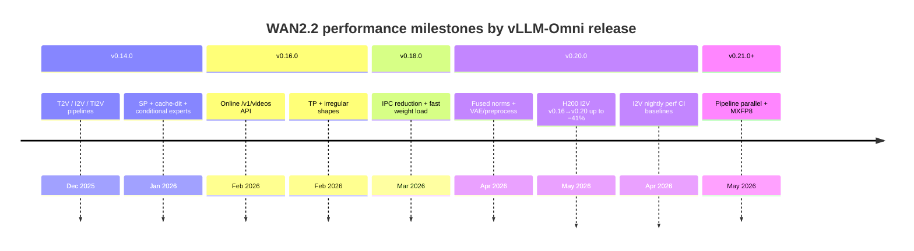

# WAN2.2

**Category:** Diffusion (image / video generation)  
**Models:** `Wan-AI/Wan2.2-T2V-A14B-Diffusers`, `Wan-AI/Wan2.2-I2V-A14B-Diffusers`, `Wan-AI/Wan2.2-TI2V-5B-Diffusers`, Wan2.2-S2V  
**Recipes (vLLM-Omni):**

- [Wan2.2 I2V](https://github.com/vllm-project/vllm-omni/blob/main/recipes/Wan-AI/Wan2.2-I2V.md)
- [Wan2.2 S2V](https://github.com/vllm-project/vllm-omni/blob/main/recipes/Wan-AI/Wan2.2-S2V.md)
- [Serving performance dashboard](https://github.com/vllm-project/vllm-omni/blob/main/benchmarks/diffusion/performance_dashboard/wan_2_2_serving_performance.md)

Diffusion Transformer (DiT) family for text-to-video, image-to-video, text-image-to-video, and speech-to-video. The 14B variants use a **dual-transformer MoE cascade** (low-noise / high-noise experts).

**Start here for performance:** [Optimizing WAN2.2 I2V inference, step by step](#optimizing-wan22-i2v-inference-step-by-step) (pipeline → releases → PRs → how to profile the next change). Measured **v0.16.0 / v0.18.0 / v0.20.0 on 4× H200**: [comparison table](#v0160--v0180--v0200-on-4-h200-retro).

This cookbook does **not** fork benchmark JSON. Record **CFG**, **USP**, **TP**, **HSDP**, and **VAE patch parallel** when comparing releases or hardware.

## Performance tracks

| Track | Hardware | Source |
|-------|----------|--------|
| **Standardized I2V (CI)** | 2× NVIDIA H100 80GB (nightly) | [`test_wan22_i2v_vllm_omni.json`](https://github.com/vllm-project/vllm-omni/blob/main/tests/dfx/perf/tests/test_wan22_i2v_vllm_omni.json) |
| **v0.16 / v0.18 / v0.20 retro** | 4× NVIDIA H200 (measured) | [Comparison table](#v0160--v0180--v0200-on-4-h200-retro) |
| **T2V serving dashboard** | NVIDIA A100-SXM4-80GB | [`wan_2_2_serving_performance.md`](https://github.com/vllm-project/vllm-omni/blob/main/benchmarks/diffusion/performance_dashboard/wan_2_2_serving_performance.md) |
| **NPU** | 8× Ascend A2 / A3 | [Wan2.2 I2V recipe (NPU)](https://github.com/vllm-project/vllm-omni/blob/main/recipes/Wan-AI/Wan2.2-I2V.md#npu) |

Reuse the same JSON on **4× H200** (NVIDIA L20X SKU) for local runs; CI `baseline` fields are H100-only (see below).

## Standardized I2V perf test

**Config:** [`tests/dfx/perf/tests/test_wan22_i2v_vllm_omni.json`](https://github.com/vllm-project/vllm-omni/blob/main/tests/dfx/perf/tests/test_wan22_i2v_vllm_omni.json) ([#3063](https://github.com/vllm-project/vllm-omni/pull/3063), first in **v0.20.0**; not on v0.18.0)  
**Runner:** [`run_diffusion_benchmark.py`](https://github.com/vllm-project/vllm-omni/blob/main/tests/dfx/perf/scripts/run_diffusion_benchmark.py) → [`diffusion_benchmark_serving.py`](https://github.com/vllm-project/vllm-omni/blob/main/benchmarks/diffusion/diffusion_benchmark_serving.py)  
**Nightly:** `.buildkite/test-nightly.yml` → “Diffusion X2V · Perf Test” on **2× H100** (`gpu-h100-sxm`), image built from **`main` @ `$BUILDKITE_COMMIT`** (rolling, not a pinned release tag).

JSON `baseline` values (**26.0 / 21.6 / 101.6 s**) are **static assertion thresholds** committed with #3063 (2026-04-24, ~v0.20.0 era; upstream vLLM **0.19–0.20** in CI at that time). Nightly compares each run against them; it does not auto-update them per release.

### Test cases

| `test_name` | Serve args | Workload | CI `latency_mean` (H100) |
|-------------|------------|----------|--------------------------|
| `test_wan22_i2v_single_device` | profiler only | 832×480, 81f, 4 steps | **26.0 s** |
| `test_wan22_i2v_usp2_vae_patch2_hsdp_slicing` | `usp=2`, `vae-patch-parallel-size=2`, `use-hsdp`, `vae-use-slicing` | 832×480, 81f, 4 steps | **21.6 s** |
| same | same | 1280×720, 121f, 4 steps | **101.6 s** |

Shared: `task=i2v`, `max-concurrency=1`, `seed=42`. CI uses `num-prompts=10` and `enable-negative-prompt=true`; local retro configs under `benchmark_results/wan22_retro/config/` default to **`num-prompts=3`**, **`warmup-requests=0`** for faster A/B runs.

### How to run (v0.20.0+)

```bash
cd /path/to/vllm-omni
export CUDA_VISIBLE_DEVICES=0,1,2,3   # 4 GPUs for USP2 case
export DIFFUSION_ATTENTION_BACKEND=FLASH_ATTN
export VLLM_WORKER_MULTIPROC_METHOD=spawn

pytest -s tests/dfx/perf/scripts/run_diffusion_benchmark.py \
  --test-config-file tests/dfx/perf/tests/test_wan22_i2v_vllm_omni.json
```

Results: `tests/dfx/perf/results/` (or set `DIFFUSION_BENCHMARK_DIR`).

On non-H100 hardware, add `"skip-performance-assertion": true` per `benchmark_params` in the **vllm-omni** repo (or open a PR for new baselines)—not in this cookbook.

### v0.16.0 → v0.18.0 → v0.20.0 on 4× H200 (retro)

Same **workload shape** (random I2V, 832×480 / 1280×720, 4 steps, concurrency 1, seed 42, `/v1/videos`), measured **2026-05-20** on **NVIDIA H200** (L20X SKU). Metric: **`latency_mean`** (seconds per request, lower is better).

| Config | Workload | v0.16.0 | v0.18.0 | v0.20.0 | Δ v0.18→v0.20 | Δ v0.16→v0.20 |
|--------|----------|---------|---------|---------|---------------|---------------|
| Single device | 832×480, 81f, 4 steps | **31.33** | **23.56** | **22.17** | **−5.9%** | **−29.2%** |
| USP2 + HSDP + slicing † | 832×480, 81f, 4 steps | **22.20** | **20.26** ‡ | **16.43** ‡ | **−18.9%** | **−26.0%** |
| USP2 + HSDP + slicing † | 1280×720, 121f, 4 steps | **133.94** § | **93.67** ‡ | **79.19** ‡ | **−15.5%** | **−40.9%** |

† **v0.16.0** USP2: `usp=2`, `use-hsdp`, `vae-use-slicing` only — **no** `--vae-patch-parallel-size=2` ([#1716](https://github.com/vllm-project/vllm-omni/pull/1716) is post–v0.16); GPUs `0,1,3` (3 devices).  
‡ **v0.18.0 / v0.20.0**: add `vae-patch-parallel-size=2`, `enable-negative-prompt`, `random-request-config`; GPUs `0,1,2,3`.  
§ v0.16 720p row: **3 prompts**; other rows: **10 prompts** (per-request latency is still comparable).

**Stacks:** v0.16 → `vllm==0.16.0` + `vllm-omni==0.16.0`; v0.18 → `vllm==0.18.0` + `vllm-omni==0.18.0`; v0.20 → `vllm==0.20.0` + `vllm-omni==0.20.0`.

**Artifacts:** `vllm-omni/benchmark_results/wan22_retro/v0.16.0/`, `.../v0.18.0/`, `.../v0.20.0/`. Config templates: `.../wan22_retro/config/`.

**Takeaways:**

- **v0.16 → v0.18:** largest step on single-GPU (~25%); USP2 480p ~9% with incomplete parallel stack on v0.16.
- **v0.18 → v0.20:** largest on **USP2 @ 480p** (~19%) — fused DiT + preprocess/VAE; 720p ~16%.
- **720p** stays the cost driver (~79–134 s/request); resolution/frame count dominate.

For the optimization walkthrough, see **[Optimizing WAN2.2 I2V inference, step by step](#optimizing-wan22-i2v-inference-step-by-step)**.

#### Reproducing H200 retro

Canonical configs: `benchmark_results/wan22_retro/config/wan22_retro_common.json` (v0.18/v0.20) and `wan22_retro_v016.json` (v0.16 flat flags). Default **`num-prompts=3`**, **`warmup-requests=0`**; override with `WAN22_RETRO_NUM_PROMPTS=10`.

**v0.20.0** (tag + pytest):

```bash
git worktree add ../vllm-omni-v020 v0.20.0 && cd ../vllm-omni-v020
# uv venv + vllm==0.20.0 + editable vllm-omni (see AGENTS.md)
export CUDA_VISIBLE_DEVICES=0,1,2,3 HF_HOME=/models
export DIFFUSION_ATTENTION_BACKEND=FLASH_ATTN VLLM_WORKER_MULTIPROC_METHOD=spawn
bash /path/to/vllm-omni/benchmark_results/wan22_retro/v0.20.0/run_benchmark.sh
```

**v0.18.0** — pytest runner on that tag passes invalid `--backend vllm-omni` for i2v; use `run_retro.py` with `--backend v1/videos`:

```bash
bash /path/to/vllm-omni/benchmark_results/wan22_retro/v0.18.0/run_benchmark.sh
```

**v0.16.0** — no `tests/dfx/perf/` JSON; sync `/v1/videos` API; retro patches in v016 worktree `benchmarks/diffusion/backends.py`:

```bash
bash /path/to/vllm-omni/benchmark_results/wan22_retro/v0.16.0/run_benchmark.sh
# cleanup orphaned GPU workers: bash .../v0.16.0/cleanup.sh
```

On non-H100 hardware, add `"skip-performance-assertion": true` per `benchmark_params` (v0.20 JSON template includes this for H200).

### Other `tests/` paths

| Path | Role |
|------|------|
| `tests/e2e/online_serving/test_wan22_expansion.py` | Correctness |
| `tests/e2e/accuracy/wan22_i2v/` | Quality (SSIM/PSNR) |
| `tests/dfx/stability/tests/test_wan22.json` | Long-run stability |

## Optimizing WAN2.2 I2V inference, step by step

This section is a **reader’s guide**: how vLLM-Omni improved Wan2.2 I2V over releases, in the order you would investigate and optimize a production path—not a flat PR list.

### 1. Know one request end-to-end

A single standardized benchmark request (`/v1/videos`, I2V) roughly does:


On **4× H200** with `test_wan22_i2v_usp2_vae_patch2_hsdp_slicing`:

- **DiT** runs with `usp=2`, `use-hsdp`, dual 14B experts (biggest slice of time).
- **VAE** uses `vae-patch-parallel-size=2`, `vae-use-slicing`.
- **Profiler** (`--enable-diffusion-pipeline-profiler`) logs per-stage times in server logs—use this to see *which box* your change moved.

**Rule:** Optimize the **largest box** first, on the **same hardware + JSON** you ship ([H200 A/B table](#v0160--v0180--v0200-on-4-h200-retro)).

### 2. Build the parallel stack (before micro-kernels)

You cannot fuse norms effectively until the model is **served in parallel** on enough GPUs.

| Step | Release | What we did | Why it matters |
|------|---------|-------------|----------------|
| 2.1 | v0.14.0 | Wan2.2 T2V / I2V / TI2V pipelines ([#202](https://github.com/vllm-project/vllm-omni/pull/202), [#329](https://github.com/vllm-project/vllm-omni/pull/329)) | Baseline correctness |
| 2.2 | v0.14.0 | Ulysses SP, CFG parallel, conditional MoE load ([#966](https://github.com/vllm-project/vllm-omni/pull/966), [#851](https://github.com/vllm-project/vllm-omni/pull/851), [#980](https://github.com/vllm-project/vllm-omni/pull/980)) | Multi-GPU DiT primitives |
| 2.3 | v0.14.0 | VAE patch parallel ([#756](https://github.com/vllm-project/vllm-omni/pull/756)) | Scale VAE with width |
| 2.4 | v0.16.0 | Online `/v1/videos` API ([#1073](https://github.com/vllm-project/vllm-omni/pull/1073)), TP ([#964](https://github.com/vllm-project/vllm-omni/pull/964)), HSDP ([#1339](https://github.com/vllm-project/vllm-omni/pull/1339)) | Production serving + sharding |

**Perf test config** `test_wan22_i2v_usp2_vae_patch2_hsdp_slicing` is the “fully wired” 4-GPU recipe from this phase.

### 3. Cut serving overhead (v0.18.0)

Before touching DiT math, remove **fixed tax** on every online request.

| Step | PR | What we did | Measured signal |
|------|-----|-------------|-----------------|
| 3.1 | [#1715](https://github.com/vllm-project/vllm-omni/pull/1715) | Less IPC between processes in single-stage online Wan2.2 | Online I2V e2e **37.5 s → 31.0 s** (−17.5%) on a *different* workload—not the standardized JSON |
| 3.2 | [#1504](https://github.com/vllm-project/vllm-omni/pull/1504) | Multi-thread safetensors load | Faster **cold start**, not per-request latency |
| 3.3 | [#1979](https://github.com/vllm-project/vllm-omni/pull/1979) | Align offline vs online config | Fewer “works offline, slow online” surprises |

**Lesson:** v0.18.0 is the **serving-efficiency** release. Our [H200 retro v0.18.0](#v0160--v0180--v0200-on-4-h200-retro) number is the baseline *after* this step, for the JSON workload.

### 4. Shrink preprocess and VAE (v0.20.0, steps 4a–4c)

These hit boxes **C–D and F** in the diagram. They show up strongly when resolution/frame count grow (720p, 121 frames).

| Step | PR | What we did | How to verify |
|------|-----|-------------|---------------|
| 4a | [#2963](https://github.com/vllm-project/vllm-omni/pull/2963) | Remove **duplicate** video preprocess in Wan2.2 pipeline | Profiler: less time before VAE encode; fewer redundant copies |
| 4b | [#2852](https://github.com/vllm-project/vllm-omni/pull/2852) | **Free GPU** during I2V image preprocess | Less GPU idle blocking; better overlap before DiT |
| 4c | [#2391](https://github.com/vllm-project/vllm-omni/pull/2391) | I2V **VAE FP32 → BF16** | Faster `vae.encode` / decode; lower memory |

**H200 signal:** 1280×720 workload **93.67 s → 79.19 s** (−15.5%) combines VAE + DiT gains; preprocess/VAE weigh more at higher pixel count.

### 5. Fuse and streamline the DiT loop (v0.20.0, steps 5a–5e)

These hit box **E** (denoise loop). Wan2.2 14B I2V stacks many **RMSNorm**, **AdaLayerNorm**, **RoPE**, and **attention** ops per step—ideal fusion targets.

| Step | PR | What we did | Optimization pattern |
|------|-----|-------------|----------------------|
| 5a | [#2583](https://github.com/vllm-project/vllm-omni/pull/2583) | **Fused RMSNorm** (GPU) | Replace small op chains with one kernel → fewer launches |
| 5b | [#2585](https://github.com/vllm-project/vllm-omni/pull/2585) | **Fused AdaLayerNorm** (GPU) | Same pattern on AdaLN blocks |
| 5c | [#2393](https://github.com/vllm-project/vllm-omni/pull/2393) | Faster **rotary embedding** | Cheaper per-layer RoPE |
| 5d | [#2459](https://github.com/vllm-project/vllm-omni/pull/2459) | **Skip Ulysses SP** when cross-attn sequence is short | Avoid SP overhead when it does not pay off |
| 5e | [#3327](https://github.com/vllm-project/vllm-omni/pull/3327) | Fix **Flash Attention / CUBLAS** path for Wan2.2 | Ensure fast attention actually runs |

**H200 signal:** USP2 @ 832×480 **20.26 s → 16.43 s** (−18.9%)—largest win, consistent with DiT dominating that config.

**NPU parallel track (same ideas, different backend):** [#3067](https://github.com/vllm-project/vllm-omni/pull/3067), [#2571](https://github.com/vllm-project/vllm-omni/pull/2571), [#2575](https://github.com/vllm-project/vllm-omni/pull/2575)/[#2576](https://github.com/vllm-project/vllm-omni/pull/2576), [#2969](https://github.com/vllm-project/vllm-omni/pull/2969)—mindie-sd fused ops + collective fixes.

### 6. Rebase the runtime (v0.20.0, step 6)

| Step | PR | What we did | Effect |
|------|-----|-------------|--------|
| 6.1 | [#3232](https://github.com/vllm-project/vllm-omni/pull/3232) | Rebase to **vLLM v0.20.0** (CUDA 13 / PyTorch 2.11 path) | Scheduler, worker, and diffusion engine alignment |
| 6.2 | [#2672](https://github.com/vllm-project/vllm-omni/pull/2672) | Refactor Wan2.2 diffusion pipelines + unit tests | Safer place to add kernels; fewer regressions |
| 6.3 | [#3352](https://github.com/vllm-project/vllm-omni/pull/3352) | CI fixes for perf under vLLM 0.20 + CUDA 13 | Trustworthy regression signal |

When comparing v0.18.0 vs v0.20.0, part of the delta is **`vllm==0.18.0` → `vllm==0.20.0`**, not only omni-side Wan patches.

### 7. Lock in regression testing (v0.20.0, step 7)

| Step | PR | What we did | Why readers should care |
|------|-----|-------------|-------------------------|
| 7.1 | [#3063](https://github.com/vllm-project/vllm-omni/pull/3063) | `test_wan22_i2v_vllm_omni.json` + nightly H100 job | One **fixed workload** so optimizations do not regress silently |
| 7.2 | [#2817](https://github.com/vllm-project/vllm-omni/pull/2817), [#2972](https://github.com/vllm-project/vllm-omni/pull/2972) | Stability / reliability tests | Throughput *and* survival under load |

CI baselines (26.0 / 21.6 / 101.6 s) are **thresholds**, not auto-updated each night. For **release deltas on H200**, use our [measured A/B](#v0160--v0180--v0200-on-4-h200-retro).

### 8. How to run the next optimization (checklist)

Use this loop for Wan2.2 (or any diffusion model in vLLM-Omni):

1. **Pick a config** — reuse [`test_wan22_i2v_vllm_omni.json`](https://github.com/vllm-project/vllm-omni/blob/main/tests/dfx/perf/tests/test_wan22_i2v_vllm_omni.json); do not invent a one-off prompt/resolution.
2. **Profile one request** — serve with `--enable-diffusion-pipeline-profiler`; read `DiffusionPipelineProfiler` lines in logs (text encoder, VAE encode, denoise steps, VAE decode).
3. **Classify the bottleneck** — preprocess vs VAE vs DiT vs API/IPC (see diagram in §1).
4. **Apply one change** — fused op, dtype, remove duplicate pass, SP policy, etc.
5. **Re-run the JSON** on fixed hardware (e.g. 4× H200); record `latency_mean`, `throughput_qps`, `peak_memory_mb_mean`.
6. **Compare to prior tag** — same GPUs, same `serve_args`, same `CUDA_VISIBLE_DEVICES`.

```text
delta_latency_mean = (t_new - t_old) / t_old     # e.g. v0.20 vs v0.18 on H200
```

### 9. Summary: v0.18 → v0.20 on H200 in one view

| Phase | Focus | Main PRs | H200 impact (standardized JSON) |
|-------|--------|----------|----------------------------------|
| Already in v0.18 | IPC, load | #1715, #1504 | Baseline for retro (not re-measured per step) |
| Preprocess / VAE | Boxes C–D, F | #2963, #2852, #2391 | Helps 720p most (−15.5% combined with DiT) |
| DiT kernels | Box E | #2583, #2585, #2393, #2459, #3327 | USP2 480p **−18.9%** |
| Runtime | Whole stack | #3232, #2672 | Part of all three rows |
| **Net** | | | **−5.9% / −18.9% / −15.5%** |

**What’s next (v0.21.0+):** pipeline parallel ([#2322](https://github.com/vllm-project/vllm-omni/pull/2322)), GPU FP8 ([#2920](https://github.com/vllm-project/vllm-omni/pull/2920)), VAE tiling ([#3111](https://github.com/vllm-project/vllm-omni/pull/3111))—re-run the same JSON after each lands to extend this table.

## Release timeline (overview)



PRs below are grouped by the **first stable tag** that contains them ([releases](https://github.com/vllm-project/vllm-omni/releases)).

---

## v0.21.0 (upcoming)

On `main` after [v0.20.0](https://github.com/vllm-project/vllm-omni/releases/tag/v0.20.0) (2026-05-07). Performance ledger not filled yet.

### Performance

| Metric | Value | Delta from v0.20.0 |
|--------|-------|---------------------|
| I2V E2E latency (832×480, 4 steps) | — | — |
| T2V mean latency (480p dashboard) | — | — |

### Optimization Notes

| PR | Summary |
|----|---------|
| [#2322](https://github.com/vllm-project/vllm-omni/pull/2322) | Pipeline parallelism for Wan 2.2 |
| [#3140](https://github.com/vllm-project/vllm-omni/pull/3140) | MXFP8 W8A8 on Ascend NPU (T2V / I2V / TI2V) |
| [#2640](https://github.com/vllm-project/vllm-omni/pull/2640) | Online FP8 flash attention on NPU |
| [#3271](https://github.com/vllm-project/vllm-omni/pull/3271) | Wan2.2-I2V GPU recipe (8× H100/A100/H20) |
| [#3463](https://github.com/vllm-project/vllm-omni/pull/3463) | ROCm wan22 bugfix |

### In progress

| PR | Topic |
|----|-------|
| [#3127](https://github.com/vllm-project/vllm-omni/pull/3127) | Remove redundant `empty_cache` on NPU |
| [#3145](https://github.com/vllm-project/vllm-omni/pull/3145) | VAE `blend_v` / `blend_h` |
| [#3270](https://github.com/vllm-project/vllm-omni/pull/3270) | Triton fused AdaLN (WIP) |
| [#3111](https://github.com/vllm-project/vllm-omni/pull/3111) | VAE tiling interfaces |
| [#2920](https://github.com/vllm-project/vllm-omni/pull/2920) | Online FP8 `quant_config` (GPU) |

---

## v0.20.0 (2026-05-07)

[v0.20.0](https://github.com/vllm-project/vllm-omni/releases/tag/v0.20.0) — aligned with upstream **vLLM v0.20.0**; fused DiT kernels, preprocess/VAE fixes, S2V, **I2V perf CI + JSON baselines** ([#3063](https://github.com/vllm-project/vllm-omni/pull/3063)).

### Performance

Model: `Wan-AI/Wan2.2-I2V-A14B-Diffusers`. Standardized workload: random dataset, concurrency **1**, negative prompt, `seed=42`.

**I2V — CI H100 baselines (2× GPU, assertion thresholds in JSON):**

| Config | Workload | `latency_mean` | `throughput_qps` | Peak mem (mean) |
|--------|----------|----------------|------------------|-----------------|
| Single device | 832×480, 81f, 4 steps | **26.0 s** | 0.034 | ~80 GB |
| USP2 + VAE-pp2 + HSDP + slicing | 832×480, 81f, 4 steps | **21.6 s** | 0.042 | ~55 GB |
| USP2 + VAE-pp2 + HSDP + slicing | 1280×720, 121f, 4 steps | **101.6 s** | 0.0085 | ~65 GB |

**I2V — measured 4× H200 (2026-05-20):**

| Config | Workload | `latency_mean` | Δ vs v0.18.0 | Δ vs v0.16.0 |
|--------|----------|----------------|--------------|--------------|
| Single device | 832×480, 81f, 4 steps | **22.17 s** | **−5.9%** | **−29.2%** |
| USP2 + VAE-pp2 + HSDP + slicing | 832×480, 81f, 4 steps | **16.43 s** | **−18.9%** | **−26.0%** † |
| USP2 + VAE-pp2 + HSDP + slicing | 1280×720, 121f, 4 steps | **79.19 s** | **−15.5%** | **−40.9%** † |

† v0.16 USP2 retro used no VAE patch-parallel CLI; see [three-way table](#v0160--v0180--v0200-on-4-h200-retro).

Full comparison and optimization breakdown: [v0.16.0 → v0.18.0 → v0.20.0 on 4× H200](#v0160--v0180--v0200-on-4-h200-retro).

**T2V dashboard** (`Wan-AI/Wan2.2-T2V-A14B-Diffusers`, A100, CFG=2, USP=2, HSDP=On) — [`wan_2_2_serving_performance.md`](https://github.com/vllm-project/vllm-omni/blob/main/benchmarks/diffusion/performance_dashboard/wan_2_2_serving_performance.md):

| Dataset | VAE parallel | Mean latency | Δ vs VAE-pp=1 |
|---------|--------------|--------------|-----------------|
| 480p, 3 steps | 1 → **4** | 24.68 s → **21.68 s** | **−12%** |
| 720p, 6 steps | 1 → **4** | 124.66 s → **117.44 s** | **−6%** |

**NPU (recipe, not CI JSON):** Laser Attention up to **~40%** at 720p; mindie-sd fused norms ([#3067](https://github.com/vllm-project/vllm-omni/pull/3067)).

### Optimization Notes

See **[Optimizing WAN2.2 I2V inference, step by step](#optimizing-wan22-i2v-inference-step-by-step)** for the full walkthrough. PR index:

| PR | Platform | Summary |
|----|----------|---------|
| [#3232](https://github.com/vllm-project/vllm-omni/pull/3232) | Both | Rebase to upstream vLLM v0.20.0 |
| [#2583](https://github.com/vllm-project/vllm-omni/pull/2583) | GPU | Fused RMSNorm |
| [#2585](https://github.com/vllm-project/vllm-omni/pull/2585) | GPU | Fused AdaLayerNorm |
| [#2393](https://github.com/vllm-project/vllm-omni/pull/2393) | Both | Optimize rotary embedding |
| [#2459](https://github.com/vllm-project/vllm-omni/pull/2459) | GPU | Skip Ulysses SP on short cross-attention |
| [#3327](https://github.com/vllm-project/vllm-omni/pull/3327) | GPU | Flash Attention / CUBLAS fix (Wan2.2) |
| [#2852](https://github.com/vllm-project/vllm-omni/pull/2852) | GPU | Free GPU during I2V image preprocess |
| [#2963](https://github.com/vllm-project/vllm-omni/pull/2963) | Both | Remove duplicate video preprocess |
| [#2391](https://github.com/vllm-project/vllm-omni/pull/2391) | Both | I2V VAE FP32 → BF16 |
| [#2672](https://github.com/vllm-project/vllm-omni/pull/2672) | Both | Refactor diffusion pipelines |
| [#3067](https://github.com/vllm-project/vllm-omni/pull/3067) | NPU | Fused RMSNorm (mindie-sd) |
| [#2571](https://github.com/vllm-project/vllm-omni/pull/2571) | NPU | Fused RoPE + cache |
| [#2969](https://github.com/vllm-project/vllm-omni/pull/2969) | NPU | VAE parallel `all_gather` |
| [#3063](https://github.com/vllm-project/vllm-omni/pull/3063) | CI | Wan22 I2V perf nightly + JSON baselines |
| [#2751](https://github.com/vllm-project/vllm-omni/pull/2751) | Both | Wan2.2-S2V (new model) |
| [#2134](https://github.com/vllm-project/vllm-omni/pull/2134) | Both | LightX2V offline conversion |

---

## v0.18.0 (2026-03-28)

[v0.18.0](https://github.com/vllm-project/vllm-omni/releases/tag/v0.18.0) — online serving latency and reliability; **no standardized I2V perf JSON** ([#3063](https://github.com/vllm-project/vllm-omni/pull/3063) landed 2026-04-24).

### Performance

**Standardized workload** (4× H200 retro — [three-way table](#v0160--v0180--v0200-on-4-h200-retro)):

| Config | 832×480 (81f, 4 steps) | 1280×720 (121f, 4 steps) |
|--------|------------------------|---------------------------|
| Single device | **23.56 s** | — |
| USP2 + VAE-pp2 + HSDP + slicing | **20.26 s** | **93.67 s** |

v0.16.0 retro: **31.33 s** / **22.20 s** † / **133.94 s** §. v0.20.0: **22.17 s** / **16.43 s** / **79.19 s**.

**Other (different workload):**

| Metric | Value | Δ from v0.16.0 |
|--------|-------|----------------|
| Online I2V e2e ([#1715](https://github.com/vllm-project/vllm-omni/pull/1715)) | 37.5 s → **31.0 s** | **−17.5%** |
| 14B I2V weight load ([#1504](https://github.com/vllm-project/vllm-omni/pull/1504)) | ~5 min → faster | Multi-thread safetensors |

### Optimization Notes

| PR | Summary |
|----|---------|
| [#1715](https://github.com/vllm-project/vllm-omni/pull/1715) | Reduce IPC overhead (online Wan2.2) |
| [#1504](https://github.com/vllm-project/vllm-omni/pull/1504) | Multi-thread safetensors load |
| [#1392](https://github.com/vllm-project/vllm-omni/pull/1392) | cache-dit fix for TI2V-5B |
| [#1979](https://github.com/vllm-project/vllm-omni/pull/1979) | Align offline vs online diffusion config |
| [#2087](https://github.com/vllm-project/vllm-omni/pull/2087) | L4 diffusion feature tests |

---

## v0.16.0 (2026-02-28)

[v0.16.0](https://github.com/vllm-project/vllm-omni/releases/tag/v0.16.0) — OpenAI `/v1/videos`, TP, HSDP. **No** standardized I2V perf JSON ([#3063](https://github.com/vllm-project/vllm-omni/pull/3063) landed later); retro numbers below use the same workload *shape* as v0.18/v0.20.

### Performance

**I2V — measured 4× H200 retro (2026-05-20):** see [v0.16.0 → v0.18.0 → v0.20.0](#v0160--v0180--v0200-on-4-h200-retro).

| Config | Workload | `latency_mean` | Notes |
|--------|----------|----------------|-------|
| Single device | 832×480, 81f, 4 steps | **31.33 s** | 10 prompts; no negative-prompt in benchmark |
| USP2 + HSDP + slicing | 832×480, 81f, 4 steps | **22.20 s** | No `vae-patch-parallel-size=2`; 3 GPUs |
| USP2 + HSDP + slicing | 1280×720, 121f, 4 steps | **133.94 s** | 3 prompts |

Δ vs v0.20.0 on same hardware: **−29.2%** (single), **−26.0%** / **−40.9%** (USP2 rows — not apples-to-apples on serve flags).

### Optimization Notes

| PR | Summary |
|----|---------|
| [#1073](https://github.com/vllm-project/vllm-omni/pull/1073) | Online T2V / I2V via `/v1/videos` |
| [#964](https://github.com/vllm-project/vllm-omni/pull/964) | Tensor parallelism (14B DiT) |
| [#1279](https://github.com/vllm-project/vllm-omni/pull/1279) | Irregular output shapes |
| [#1221](https://github.com/vllm-project/vllm-omni/pull/1221) | TI2V warmup fix |
| [#1339](https://github.com/vllm-project/vllm-omni/pull/1339) | HSDP for diffusion |

_Already in v0.14.0:_ CFG parallel ([#851](https://github.com/vllm-project/vllm-omni/pull/851)), Ulysses SP ([#966](https://github.com/vllm-project/vllm-omni/pull/966)), cache-dit ([#1021](https://github.com/vllm-project/vllm-omni/pull/1021)), conditional experts ([#980](https://github.com/vllm-project/vllm-omni/pull/980)), VAE patch parallel ([#756](https://github.com/vllm-project/vllm-omni/pull/756)).

---

## v0.14.0 (2026-01-31)

[v0.14.0](https://github.com/vllm-project/vllm-omni/releases/tag/v0.14.0) — first stable Wan2.2 T2V / I2V / TI2V.

### Optimization Notes

| PR | Summary |
|----|---------|
| [#202](https://github.com/vllm-project/vllm-omni/pull/202) | Wan2.2 T2V pipeline |
| [#329](https://github.com/vllm-project/vllm-omni/pull/329) | Wan2.2 I2V + TI2V |
| [#966](https://github.com/vllm-project/vllm-omni/pull/966) | Ulysses SP |
| [#980](https://github.com/vllm-project/vllm-omni/pull/980) | Conditional dual-transformer loading |
| [#1021](https://github.com/vllm-project/vllm-omni/pull/1021) | Cache-DiT |
| [#851](https://github.com/vllm-project/vllm-omni/pull/851) | CFG parallel |
| [#858](https://github.com/vllm-project/vllm-omni/pull/858) | Layerwise CPU offloading |
| [#804](https://github.com/vllm-project/vllm-omni/pull/804) | UniPC scheduler |
| [#791](https://github.com/vllm-project/vllm-omni/pull/791) | I2V warmup fix |

---

## Appendix: GPU vs NPU deployment

Serve commands match [`test_wan22_i2v_vllm_omni.json`](https://github.com/vllm-project/vllm-omni/blob/main/tests/dfx/perf/tests/test_wan22_i2v_vllm_omni.json). For **8-card production**, see the [Wan2.2 I2V recipe](https://github.com/vllm-project/vllm-omni/blob/main/recipes/Wan-AI/Wan2.2-I2V.md).

| Dimension | GPU (CUDA) | NPU (Ascend) |
|-----------|------------|--------------|
| **Perf JSON** | `test_wan22_i2v_vllm_omni.json` | Recipe + `test_wan22_expansion` (no H100 baselines) |
| **Standard multi-GPU case** | `test_wan22_i2v_usp2_vae_patch2_hsdp_slicing` (4 GPUs) | `npu_i2v_combined` (4-card) |
| **Fused ops (v0.20.0+)** | In-repo RMSNorm / AdaLN | mindie-sd + [#3067](https://github.com/vllm-project/vllm-omni/pull/3067) |
| **Quantization (v0.21.0+)** | FP8 in progress | MXFP8 ([#3140](https://github.com/vllm-project/vllm-omni/pull/3140)) |
| **Extra env** | `DIFFUSION_ATTENTION_BACKEND=FLASH_ATTN` | `MINDIE_SD_FA_TYPE=ascend_laser_attention`, `MULTI_STREAM_MEMORY_REUSE=2` |

### GPU serve (matches perf JSON)

**Single device** (`test_wan22_i2v_single_device`):

```bash
export DIFFUSION_ATTENTION_BACKEND=FLASH_ATTN

vllm serve Wan-AI/Wan2.2-I2V-A14B-Diffusers --omni \
  --enable-diffusion-pipeline-profiler
```

**Multi-GPU standard** (`test_wan22_i2v_usp2_vae_patch2_hsdp_slicing`, 4 GPUs):

```bash
export CUDA_VISIBLE_DEVICES=0,1,2,3
export DIFFUSION_ATTENTION_BACKEND=FLASH_ATTN
export VLLM_WORKER_MULTIPROC_METHOD=spawn

vllm serve Wan-AI/Wan2.2-I2V-A14B-Diffusers --omni \
  --usp 2 \
  --vae-patch-parallel-size 2 \
  --use-hsdp \
  --vae-use-slicing \
  --enable-diffusion-pipeline-profiler
```

### NPU (recipe / expansion, not perf JSON)

```bash
export MINDIE_SD_FA_TYPE=ascend_laser_attention
export MULTI_STREAM_MEMORY_REUSE=2

vllm serve Wan-AI/Wan2.2-I2V-A14B-Diffusers --omni \
  --cfg-parallel-size 2 \
  --usp 2 \
  --vae-patch-parallel-size 4 \
  --use-hsdp \
  --hsdp-shard-size 4
```

### 8-card production (recipe only)

```bash
# GPU
CUDA_VISIBLE_DEVICES=0,1,2,3,4,5,6,7 \
vllm serve Wan-AI/Wan2.2-I2V-A14B-Diffusers --omni \
  --use-hsdp --cfg-parallel-size 2 --usp 4 \
  --vae-patch-parallel-size 8 --vae-use-tiling

# NPU
export MINDIE_SD_FA_TYPE=ascend_laser_attention
export MULTI_STREAM_MEMORY_REUSE=2

vllm serve --omni Wan-AI/Wan2.2-I2V-A14B-Diffusers \
  --use-hsdp --usp 4 --cfg 2 \
  --vae-patch-parallel-size 8 --vae-use-tiling
```
