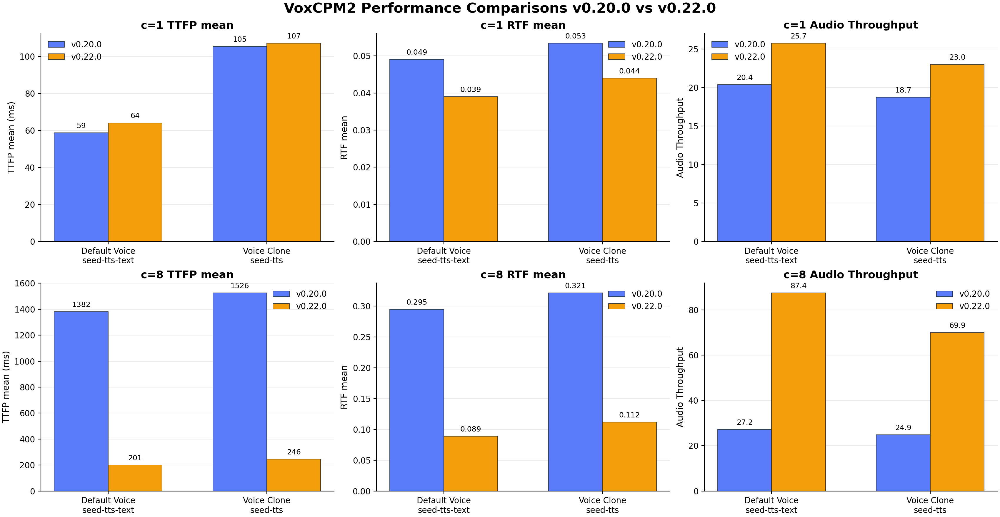

# VoxCPM2

**Model:** `openbmb/VoxCPM2`
**Recipes:** [VoxCPM2](https://github.com/vllm-project/vllm-omni/blob/main/recipes/OpenBMB/VoxCPM2.md) / [Deploy YAML](https://github.com/vllm-project/vllm-omni/blob/main/vllm_omni/deploy/voxcpm2.yaml)
**Spec:** [`test_voxcpm2.json`](https://github.com/vllm-project/vllm-omni/blob/main/tests/dfx/perf/tests/test_voxcpm2.json) / **Runner:** [`bench_tts.py`](https://github.com/vllm-project/vllm-omni/blob/main/benchmarks/tts/bench_tts.py)
vllm-omni `v0.22.0` (vllm 0.22.0) vs `v0.20.0` (vllm 0.20.0), both with `transformers==5.8.1`.

Metrics: **RTF** = `mean_audio_rtf` (audio s / wall s, **<1 = realtime**) / **TTFP** = `mean_audio_ttfp_ms` / **Tput** = `audio_throughput`.

---

## Hardware

| Box | GPU | Class | Date |
|-----|-----|-------|------|
| **L20X** | NVIDIA L20X 141GB | Ada-class | 2026-06-11 |

---

## v0.22.0

### Default Voice / `seed-tts-text`

#### L20X

| c | RTF mean | TTFP mean (ms) | Tput |
|---:|---:|---:|---:|
| 1 | 0.039 | 64 | 25.728 |
| 4 | 0.055 | 106 | 71.899 |
| 8 | 0.089 | 201 | 87.448 |
| 16 | 0.199 | 354 | 79.396 |
| 32 | 0.487 | 830 | 65.030 |

### Voice Clone / `seed-tts`

#### L20X

| c | RTF mean | TTFP mean (ms) | Tput |
|---:|---:|---:|---:|
| 1 | 0.044 | 107 | 23.000 |
| 4 | 0.071 | 160 | 56.341 |
| 8 | 0.112 | 246 | 69.896 |
| 16 | 0.219 | 420 | 72.449 |
| 32 | 0.564 | 973 | 56.537 |

---

## v0.20.0

Stress rows are intentionally excluded.

### Default Voice / `seed-tts-text`

#### L20X

| phase | c / rate | n | success / fail | TTFP mean (ms) | RTF mean | E2E mean (ms) |
|---|---:|---:|---:|---:|---:|---:|
| latency | c=1 | 20 | 20/0 | 58.76 | 0.0491 | 440.01 |
| throughput | c=8 | 80 | 80/0 | 1381.66 | 0.2946 | 2525.25 |

### Voice Clone / `seed-tts`

#### L20X

| phase | c / rate | n | success / fail | TTFP mean (ms) | RTF mean | E2E mean (ms) |
|---|---:|---:|---:|---:|---:|---:|
| latency | c=1 | 20 | 20/0 | 105.37 | 0.0534 | 468.71 |
| throughput | c=8 | 80 | 80/0 | 1525.90 | 0.3214 | 2788.16 |

---

## What the numbers say

- v0.22.0 stays below realtime on L20X through c=32 for both `default_voice` and `voice_clone`.
- v0.22.0 `default_voice` has lower RTF than `voice_clone` at every measured concurrency.
- **Default voice improves strongly at c=8:** RTF mean drops from 0.2946 to 0.089 (**-69.8%**), and TTFP mean drops from 1381.66 ms to 201 ms (**-85.5%**). At c=1, RTF improves from 0.0491 to 0.039 (**-20.6%**).
- **Voice clone shows the same high-concurrency win:** at c=8, RTF mean drops from 0.3214 to 0.112 (**-65.2%**), and TTFP mean drops from 1525.90 ms to 246 ms (**-83.9%**). At c=1, RTF improves from 0.0534 to 0.044 (**-17.6%**), with TTFP roughly flat at 105.37 ms to 107 ms (**+1.5%**).

---
